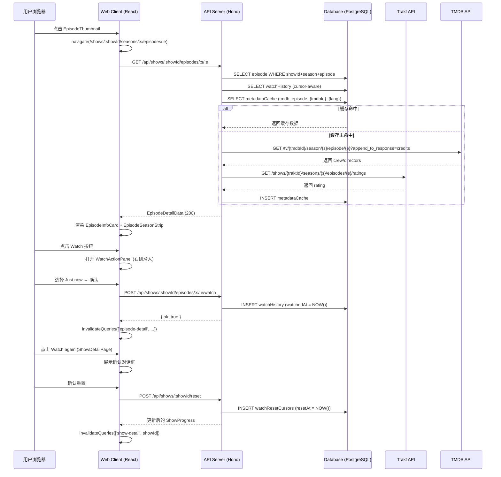

# Design Document: Episode Detail Page

## Overview

本设计文档描述 **Episode Detail Page**（单集详情页）功能的技术实现方案。该功能在现有 Trakt TV Show Tracker 应用基础上，为每一集添加专属详情页，支持查看集元数据、标记已观看、查看/删除观看历史、以及重置剧集进度。

### 设计目标

- 与现有 `ShowDetailPage` 保持视觉一致性（深色主题、紫色主色调、Tailwind CSS）
- 最小化新增数据库表：仅新增 `watchHistory` 扩展字段（`watchedAt` 可为 null）和 `watchResetCursors` 表
- 复用现有 MetadataCache 机制缓存 TMDB 单集扩展数据
- 所有新增 API 端点遵循现有 Hono 路由风格，通过 `userId` 中间件鉴权

### 关键设计决策

| 决策 | 选择 | 理由 |
|------|------|------|
| 观看历史存储 | 扩展现有 `watchHistory` 表，允许 `watchedAt` 为 null | 避免新增表，Unknown date 场景用 null 表示 |
| 进度重置 | 新增 `watchResetCursors` 表存储游标时间戳 | 保留历史记录，仅改变计算窗口 |
| 导演数据来源 | TMDB `/tv/{id}/season/{s}/episode/{e}?append_to_response=credits` | 现有 `getTmdbSeason` 不含 crew，需新增单集详情接口 |
| 评分来源 | Trakt `/shows/{traktId}/seasons/{s}/episodes/{e}/ratings` | Trakt 已有评分 API，复用现有 traktFetch |
| 右侧滑出面板 | 单一 `SlidingPanel` 基础组件，`WatchActionPanel` / `WatchHistoryPanel` 作为内容 | 复用动画逻辑，减少重复代码 |


## Architecture

### 系统交互流程



### 前后端模块划分

```
apps/web/src/
├── pages/
│   └── EpisodeDetailPage.tsx          # 新增：单集详情页
├── components/
│   ├── EpisodeInfoCard.tsx             # 新增：顶部信息卡片
│   ├── EpisodeSeasonStrip.tsx          # 新增：底部横向滚动列表
│   ├── SlidingPanel.tsx                # 新增：右侧滑出面板基础组件
│   ├── WatchActionPanel.tsx            # 新增：标记已观看操作面板
│   ├── WatchHistoryPanel.tsx           # 新增：观看历史面板
│   ├── DateTimePickerModal.tsx         # 新增：日期时间选择器弹窗
│   └── EpisodeGrid.tsx                 # 修改：EpisodeThumbnail 添加点击导航
├── hooks/
│   └── index.ts                        # 修改：新增 useEpisodeDetail, useWatchHistory 等
└── lib/
    └── api.ts                          # 修改：新增 episodes.* API 方法

apps/api/src/routes/
├── shows.ts                            # 修改：新增 episode detail / watch / history / reset 端点
└── episodes.ts                         # 新增（可选）：单独拆分集相关路由

packages/db/src/
└── schema.ts                           # 修改：watchHistory 允许 watchedAt null；新增 watchResetCursors 表

packages/types/src/
└── index.ts                            # 修改：新增 EpisodeDetailData, WatchHistoryEntry, WatchResetCursor 类型
```


## Components and Interfaces

### 路由注册（App.tsx）

```tsx
// 在现有路由中新增
<Route path="/shows/:showId/seasons/:season/episodes/:episode" element={<EpisodeDetailPage />} />
```

### EpisodeDetailPage

```tsx
// apps/web/src/pages/EpisodeDetailPage.tsx
interface RouteParams {
  showId: string    // 必须为正整数字符串
  season: string    // 必须为正整数字符串
  episode: string   // 必须为正整数字符串
}

// 路由参数校验：若任一参数非正整数，重定向至 /progress
// 使用 useEpisodeDetail(showId, season, episode) 获取数据
// 加载中：<EpisodeDetailSkeleton />
// 错误：<PageError onRetry={refetch} />
// 成功：<EpisodeInfoCard /> + <EpisodeSeasonStrip />
```

### EpisodeInfoCard

```tsx
// apps/web/src/components/EpisodeInfoCard.tsx
interface EpisodeInfoCardProps {
  data: EpisodeDetailData
  onWatchClick: () => void      // 打开 WatchActionPanel
  onHistoryClick: () => void    // 打开 WatchHistoryPanel
}

// 布局：左侧 16:9 截图（~480px 宽）+ 右侧元数据区
// 截图加载失败时展示 EpisodePlaceholder
// 标题：translatedTitle ?? title
// 简介：translatedOverview ?? overview（均为 null 时不渲染）
// 评分：traktRating 非 null 时展示 "{N}%" 徽章
// 导演：directors.length > 0 时展示
// Watch 按钮 + History 按钮（Watch 按钮区域）
```

### EpisodeSeasonStrip

```tsx
// apps/web/src/components/EpisodeSeasonStrip.tsx
interface EpisodeSeasonStripProps {
  episodes: EpisodeProgress[]
  seasonNumber: number
  currentEpisodeNumber: number
  showId: number
}

// 横向滚动容器，snap-x snap-mandatory
// 当前集：高亮边框（border-violet-500）+ aria-current="true"
// 页面加载后自动 scrollIntoView 当前集缩略图
// 点击非未播出集 → navigate(/shows/:showId/seasons/:s/episodes/:e)
// 复用 EpisodeThumbnail 样式，新增 isCurrent prop
```

### SlidingPanel

```tsx
// apps/web/src/components/SlidingPanel.tsx
interface SlidingPanelProps {
  open: boolean
  onClose: () => void
  children: React.ReactNode
  title: string
  width?: string   // 默认 '380px'
}

// 从右侧滑入，Framer Motion x: '100%' → x: 0
// 点击遮罩层或按 Escape 关闭
// 遮罩：bg-black/50 backdrop-blur-sm
```

### WatchActionPanel

```tsx
// apps/web/src/components/WatchActionPanel.tsx
interface WatchActionPanelProps {
  open: boolean
  onClose: () => void
  episodeId: number
  showId: number
  seasonNumber: number
  episodeNumber: number
  airDate: string | null
  onSuccess: () => void   // 写入成功后刷新数据
}

// 视图状态：'options' | 'confirm'
// options 视图：四个选项按钮（Just now / Release date / Other date / Unknown date）
// Release date 选项：airDate 为 null 时禁用
// confirm 视图：时间摘要 + Mark as Watched（紫色）+ Cancel（灰色）
// Other date → 打开 DateTimePickerModal（不切换到 confirm 视图）
```

### DateTimePickerModal

```tsx
// apps/web/src/components/DateTimePickerModal.tsx
interface DateTimePickerModalProps {
  open: boolean
  onClose: () => void
  onConfirm: (isoString: string) => void   // UTC ISO 8601 时间戳
  defaultValue?: Date
}

// 独立弹窗（非 SlidingPanel），居中显示
// 日期时间输入框：本地化格式 YYYY/MM/DD 上午/下午 HH:mm
// 左侧日历图标（装饰）+ 右侧日历按钮（触发 input[type=datetime-local]）
// 默认值：当前日期时间
// Cancel → onClose；Mark as Watched → onConfirm(toISOString())
```

### WatchHistoryPanel

```tsx
// apps/web/src/components/WatchHistoryPanel.tsx
interface WatchHistoryPanelProps {
  open: boolean
  onClose: () => void
  showId: number
  seasonNumber?: number    // 有值时查询单集历史，无值时查询全剧历史
  episodeNumber?: number
  onDeleted: () => void    // 删除后刷新数据
}

// 使用 useWatchHistory(showId, season?, episode?) 获取数据
// 每条记录：集标题 + 观看时间（相对/绝对）+ 删除按钮
// watchedAt 为 null → 展示"未知时间"
// 空列表 → 展示"暂无观看记录"
// 删除：点击垃圾桶 → 内联确认 → DELETE API → 刷新列表
```

### EpisodeGrid（修改）

```tsx
// EpisodeThumbnail 新增 onClick 导航
// 非未播出集：onClick={() => navigate(`/shows/${showId}/seasons/${seasonNumber}/episodes/${ep.episodeNumber}`)}
// 需要从父组件 EpisodeGrid 传入 showId prop
```


## Data Models

### 数据库 Schema 变更

#### 1. 修改 `watchHistory` 表：允许 `watchedAt` 为 null

现有 `watchedAt` 字段为 `NOT NULL`，需改为可空以支持 "Unknown date" 场景。同时现有的 `watch_history_dedup_idx` 唯一索引包含 `watchedAt`，null 值在 PostgreSQL 中不参与唯一约束，因此 Unknown date 记录可多次插入（符合需求）。

```sql
-- Migration: 0004_watch_history_nullable_watched_at.sql
ALTER TABLE watch_history ALTER COLUMN watched_at DROP NOT NULL;
```

对应 Drizzle schema 修改：

```typescript
// packages/db/src/schema.ts
export const watchHistory = pgTable('watch_history', {
  id: serial('id').primaryKey(),
  userId: integer('user_id').notNull().references(() => users.id, { onDelete: 'cascade' }),
  episodeId: integer('episode_id').notNull().references(() => episodes.id, { onDelete: 'cascade' }),
  watchedAt: timestamp('watched_at'),   // 改为可空，支持 Unknown date
  traktPlayId: text('trakt_play_id').unique(),
  source: text('source').notNull().default('manual'),  // 新增：'trakt' | 'manual'
}, ...)
```

#### 2. 新增 `watchResetCursors` 表

```typescript
// packages/db/src/schema.ts
export const watchResetCursors = pgTable('watch_reset_cursors', {
  id: serial('id').primaryKey(),
  userId: integer('user_id').notNull().references(() => users.id, { onDelete: 'cascade' }),
  showId: integer('show_id').notNull().references(() => shows.id, { onDelete: 'cascade' }),
  resetAt: timestamp('reset_at').notNull().defaultNow(),
  createdAt: timestamp('created_at').defaultNow().notNull(),
}, (t) => [
  index('wrc_user_show_idx').on(t.userId, t.showId),
  index('wrc_reset_at_idx').on(t.resetAt),
])
```

对应迁移 SQL：

```sql
-- Migration: 0004_watch_history_nullable_watched_at.sql (续)
CREATE TABLE watch_reset_cursors (
  id          SERIAL PRIMARY KEY,
  user_id     INTEGER NOT NULL REFERENCES users(id) ON DELETE CASCADE,
  show_id     INTEGER NOT NULL REFERENCES shows(id) ON DELETE CASCADE,
  reset_at    TIMESTAMP NOT NULL DEFAULT NOW(),
  created_at  TIMESTAMP NOT NULL DEFAULT NOW()
);
CREATE INDEX wrc_user_show_idx ON watch_reset_cursors(user_id, show_id);
CREATE INDEX wrc_reset_at_idx  ON watch_reset_cursors(reset_at);
```

### 新增 TypeScript 类型（packages/types/src/index.ts）

```typescript
// 单集详情 API 响应
export interface EpisodeDetailData {
  episodeId: number
  showId: number
  seasonNumber: number
  episodeNumber: number
  title: string | null
  translatedTitle: string | null
  overview: string | null
  translatedOverview: string | null
  airDate: string | null
  runtime: number | null
  stillPath: string | null
  watched: boolean
  watchedAt: string | null
  traktRating: number | null        // 0–100 整数，来自 Trakt ratings API
  directors: string[]               // 来自 TMDB credits.crew，job === 'Director'
  show: {
    id: number
    title: string
    posterPath: string | null
    genres: string[]
    traktId: number | null
    tmdbId: number
  }
  // 当前季所有集（用于 EpisodeSeasonStrip）
  seasonEpisodes: EpisodeProgress[]
}

// 观看历史条目
export interface WatchHistoryEntry {
  id: number
  episodeId: number
  seasonNumber: number
  episodeNumber: number
  episodeTitle: string | null
  watchedAt: string | null    // ISO 8601 或 null（Unknown date）
  source: 'trakt' | 'manual'
}

// 重置游标
export interface WatchResetCursor {
  id: number
  userId: number
  showId: number
  resetAt: string    // ISO 8601
}
```


## Backend API Design

所有端点均通过现有 `authMiddleware` 鉴权，从 `c.get('userId')` 获取用户 ID。

### GET /api/shows/:showId/episodes/:season/:episode

返回单集完整详情数据。

**请求参数**

| 参数 | 类型 | 说明 |
|------|------|------|
| showId | path: number | 剧集内部 ID（正整数） |
| season | path: number | 季编号（正整数） |
| episode | path: number | 集编号（正整数） |

**响应 200**

```json
{
  "data": {
    "episodeId": 12345,
    "showId": 42,
    "seasonNumber": 2,
    "episodeNumber": 5,
    "title": "The One Where...",
    "translatedTitle": "那一集...",
    "overview": "...",
    "translatedOverview": "...",
    "airDate": "2023-09-15",
    "runtime": 45,
    "stillPath": "/abc123.jpg",
    "watched": true,
    "watchedAt": "2024-01-10T14:30:00Z",
    "traktRating": 82,
    "directors": ["Vince Gilligan"],
    "show": {
      "id": 42,
      "title": "Breaking Bad",
      "posterPath": "/poster.jpg",
      "genres": ["Drama", "Crime"],
      "traktId": 1388,
      "tmdbId": 1396
    },
    "seasonEpisodes": [ /* EpisodeProgress[] */ ]
  }
}
```

**错误响应**

| 状态码 | 场景 |
|--------|------|
| 400 | showId/season/episode 非正整数 |
| 404 | showId 不存在 |
| 404 | season/episode 在该剧集中不存在 |

**实现逻辑**

```typescript
// 1. 参数校验
// 2. 查询 episodes 表获取基础数据
// 3. 查询 watchHistory 获取最新观看记录（cursor-aware，见进度计算章节）
// 4. 查询 metadataCache (source='tmdb_episode_{tmdbId}_{lang}')
//    - 命中且 TTL < 7天：直接使用
//    - 未命中：调用 TMDB /tv/{tmdbId}/season/{s}/episode/{e}?append_to_response=credits
//             + Trakt /shows/{traktId}/seasons/{s}/episodes/{e}/ratings
//             写入 metadataCache
// 5. 查询当前季所有集（含 watched 状态）
// 6. 组装 EpisodeDetailData 返回
```

---

### POST /api/shows/:showId/episodes/:season/:episode/watch

写入一条观看记录。

**请求体**

```typescript
{
  watchedAt: string | null   // ISO 8601 UTC 时间戳，null 表示 Unknown date
  // 注：Just now 由客户端传当前时间；Release date 由客户端传 airDate 转换后的 UTC 时间戳
  // 服务端不自行生成时间，统一由客户端传入（便于测试和一致性）
}
```

**响应 201**

```json
{ "ok": true, "historyId": 9876 }
```

**实现逻辑**

```typescript
// 1. 参数校验
// 2. 查询 episodes 表确认存在
// 3. INSERT watchHistory (userId, episodeId, watchedAt, source='manual')
// 4. 更新 userShowProgress（重新计算 watchedEpisodes，cursor-aware）
// 5. 返回 { ok: true, historyId }
```

---

### GET /api/shows/:showId/episodes/:season/:episode/history

返回单集观看历史列表。

**响应 200**

```json
{
  "data": [
    {
      "id": 1,
      "episodeId": 12345,
      "seasonNumber": 2,
      "episodeNumber": 5,
      "episodeTitle": "那一集...",
      "watchedAt": "2024-01-10T14:30:00Z",
      "source": "manual"
    }
  ]
}
```

按 `watchedAt DESC NULLS LAST` 排序。

---

### GET /api/shows/:showId/history

返回该剧集所有集的观看历史，按 `watchedAt DESC NULLS LAST` 排序。响应格式同上，`data` 为 `WatchHistoryEntry[]`。

---

### DELETE /api/shows/:showId/history/:historyId

删除单条观看记录。

**响应 200**

```json
{ "ok": true }
```

**错误**：historyId 不存在或不属于当前用户 → 404。

---

### POST /api/shows/:showId/reset

插入新的 WatchResetCursor，重置进度计算起点。

**响应 200**

```json
{
  "data": { /* 更新后的 ShowProgress */ }
}
```

**实现逻辑**

```typescript
// 1. 校验 showId
// 2. INSERT watchResetCursors (userId, showId, resetAt = NOW())
// 3. 重新计算 userShowProgress（cursor-aware）
// 4. 返回更新后的 ShowProgress
```


## Data Flow Design

### React Query Hooks

```typescript
// apps/web/src/hooks/index.ts 新增

// 单集详情
export function useEpisodeDetail(showId: number, season: number, episode: number) {
  return useQuery<EpisodeDetailData>({
    queryKey: ['episode-detail', showId, season, episode],
    queryFn: () => api.episodes.detail(showId, season, episode).then(r => r.data),
    enabled: showId > 0 && season > 0 && episode > 0,
    staleTime: 1000 * 60 * 5,
  })
}

// 标记已观看
export function useMarkWatched(showId: number, season: number, episode: number) {
  const qc = useQueryClient()
  return useMutation({
    mutationFn: (watchedAt: string | null) =>
      api.episodes.watch(showId, season, episode, watchedAt),
    onSuccess: () => {
      qc.invalidateQueries({ queryKey: ['episode-detail', showId, season, episode] })
      qc.invalidateQueries({ queryKey: ['show-detail', showId] })
    },
  })
}

// 观看历史（单集）
export function useEpisodeHistory(showId: number, season: number, episode: number) {
  return useQuery<WatchHistoryEntry[]>({
    queryKey: ['episode-history', showId, season, episode],
    queryFn: () => api.episodes.history(showId, season, episode).then(r => r.data),
    enabled: showId > 0,
  })
}

// 观看历史（全剧）
export function useShowHistory(showId: number) {
  return useQuery<WatchHistoryEntry[]>({
    queryKey: ['show-history', showId],
    queryFn: () => api.shows.history(showId).then(r => r.data),
    enabled: showId > 0,
  })
}

// 删除历史记录
export function useDeleteHistory(showId: number) {
  const qc = useQueryClient()
  return useMutation({
    mutationFn: (historyId: number) => api.shows.deleteHistory(showId, historyId),
    onSuccess: () => {
      qc.invalidateQueries({ queryKey: ['episode-history'] })
      qc.invalidateQueries({ queryKey: ['show-history', showId] })
      qc.invalidateQueries({ queryKey: ['episode-detail'] })
      qc.invalidateQueries({ queryKey: ['show-detail', showId] })
    },
  })
}

// 重置进度
export function useResetProgress(showId: number) {
  const qc = useQueryClient()
  return useMutation({
    mutationFn: () => api.shows.reset(showId),
    onSuccess: () => {
      qc.invalidateQueries({ queryKey: ['show-detail', showId] })
      qc.invalidateQueries({ queryKey: ['shows-progress'] })
    },
  })
}
```

### API 客户端扩展（lib/api.ts）

```typescript
// apps/web/src/lib/api.ts 新增
episodes: {
  detail: (showId: number, season: number, episode: number) =>
    request<ApiResponse<EpisodeDetailData>>(
      `/shows/${showId}/episodes/${season}/${episode}`
    ),
  watch: (showId: number, season: number, episode: number, watchedAt: string | null) =>
    request<{ ok: boolean; historyId: number }>(
      `/shows/${showId}/episodes/${season}/${episode}/watch`,
      { method: 'POST', body: JSON.stringify({ watchedAt }) }
    ),
  history: (showId: number, season: number, episode: number) =>
    request<ApiResponse<WatchHistoryEntry[]>>(
      `/shows/${showId}/episodes/${season}/${episode}/history`
    ),
},
// shows 对象新增
shows: {
  // ...existing...
  history: (showId: number) =>
    request<ApiResponse<WatchHistoryEntry[]>>(`/shows/${showId}/history`),
  deleteHistory: (showId: number, historyId: number) =>
    request<{ ok: boolean }>(`/shows/${showId}/history/${historyId}`, { method: 'DELETE' }),
  reset: (showId: number) =>
    request<ApiResponse<ShowProgress>>(`/shows/${showId}/reset`, { method: 'POST' }),
},
```


## Key Algorithms

### 进度计算：WatchResetCursor 游标机制

进度计算是本功能最核心的算法。`watchedEpisodes` 的统计必须只计算最新游标时间点之后的观看记录。

```typescript
/**
 * 计算某用户某剧集的有效观看集数（cursor-aware）
 *
 * 算法：
 * 1. 查询该剧集最新的 WatchResetCursor（取 resetAt 最大值）
 * 2. 若存在游标，则只统计 watchedAt > resetAt 的 watchHistory 记录
 *    （watchedAt 为 null 的记录：null 表示 Unknown date，在游标之前插入的不计入，
 *     在游标之后插入的通过 createdAt 判断，但为简化实现，null watchedAt 记录
 *     始终计入当前窗口——用户主动标记的 Unknown date 应被计为已看）
 * 3. 若不存在游标，统计所有 watchHistory 记录
 * 4. 对每集取最新一条记录（去重），统计 distinct episodeId 数量
 */
async function computeWatchedEpisodes(
  db: Database,
  userId: number,
  showId: number
): Promise<number> {
  // 获取最新游标
  const [cursor] = await db
    .select({ resetAt: watchResetCursors.resetAt })
    .from(watchResetCursors)
    .where(and(
      eq(watchResetCursors.userId, userId),
      eq(watchResetCursors.showId, showId)
    ))
    .orderBy(desc(watchResetCursors.resetAt))
    .limit(1)

  const resetAt = cursor?.resetAt ?? null

  // 构建查询条件
  const whereConditions = [
    eq(watchHistory.userId, userId),
    // 通过 JOIN 限定 showId
    eq(episodes.showId, showId),
    // cursor 过滤：watchedAt > resetAt 或 watchedAt IS NULL（Unknown date 始终计入）
    resetAt
      ? or(
          gt(watchHistory.watchedAt, resetAt),
          isNull(watchHistory.watchedAt)
        )
      : undefined,
  ].filter(Boolean)

  const [{ count }] = await db
    .select({ count: sql<number>`count(distinct ${watchHistory.episodeId})` })
    .from(watchHistory)
    .innerJoin(episodes, eq(watchHistory.episodeId, episodes.id))
    .where(and(...whereConditions))

  return Number(count)
}
```

**多游标场景**

```
时间轴：
  t0: 首次观看 S01E01, S01E02, S01E03
  t1: 重置（插入 cursor1，resetAt = t1）
  t2: 重新观看 S01E01
  t3: 重置（插入 cursor2，resetAt = t3）
  t4: 重新观看 S01E01, S01E02

有效游标 = cursor2（resetAt = t3，取最大值）
有效观看记录 = t4 时刻的 S01E01, S01E02
watchedEpisodes = 2（而非 3 或 5）
历史记录完整保留：t0 的 3 条 + t2 的 1 条 + t4 的 2 条 = 6 条
```

### 多语言标题/简介解析

复用现有 `resolveEpisodeTitle` / `resolveEpisodeOverview` 函数，无需修改。后端在调用 TMDB API 时传入用户的 `displayLanguage`（从 `userSettings` 表读取），并使用语言感知的缓存键 `tmdb_episode_{tmdbId}_{language}`。

### TMDB 单集导演数据获取

```typescript
// 新增 getTmdbEpisodeDetail 函数（apps/api/src/services/tmdb.ts）
export async function getTmdbEpisodeDetail(
  tmdbShowId: number,
  seasonNumber: number,
  episodeNumber: number,
  language?: string,
  userId?: number
): Promise<{ directors: string[]; rating: number | null }> {
  const cacheKey = language
    ? `tmdb_episode_${tmdbShowId}_s${seasonNumber}e${episodeNumber}_${language}`
    : `tmdb_episode_${tmdbShowId}_s${seasonNumber}e${episodeNumber}`

  // 检查 metadataCache（TTL 7天）
  const [cached] = await db.select().from(metadataCache)
    .where(and(
      eq(metadataCache.source, 'tmdb_episode'),
      eq(metadataCache.externalId, cacheKey)
    ))
  if (cached && Date.now() - new Date(cached.cachedAt).getTime() < 7 * 24 * 60 * 60 * 1000) {
    return cached.data as { directors: string[]; rating: number | null }
  }

  // 调用 TMDB API
  const params: Record<string, string> = { append_to_response: 'credits' }
  if (language) params.language = language
  const data = await tmdbFetch<TmdbEpisodeDetail>(
    `/tv/${tmdbShowId}/season/${seasonNumber}/episode/${episodeNumber}`,
    params,
    userId
  )

  const directors = (data.credits?.crew ?? [])
    .filter((c: { job: string; name: string }) => c.job === 'Director')
    .map((c: { name: string }) => c.name)

  const result = { directors, rating: null }

  // 写入缓存
  await db.insert(metadataCache)
    .values({ source: 'tmdb_episode', externalId: cacheKey, data: result, cachedAt: new Date() })
    .onConflictDoUpdate({
      target: [metadataCache.source, metadataCache.externalId],
      set: { data: result, cachedAt: new Date() },
    })

  return result
}
```

### Trakt 单集评分获取

```typescript
// getTraktClient() 新增方法
getEpisodeRating: async (traktId: number, season: number, episode: number, userId: number) => {
  // 缓存键：trakt_ep_rating_{traktId}_s{s}e{e}，TTL 24h
  const data = await traktFetch<{ rating: number; votes: number }>(
    `/shows/${traktId}/seasons/${season}/episodes/${episode}/ratings`,
    userId
  )
  // rating 为 0–10 浮点数，转换为 0–100 整数
  return Math.round(data.rating * 10)
}
```


## Correctness Properties

*A property is a characteristic or behavior that should hold true across all valid executions of a system — essentially, a formal statement about what the system should do. Properties serve as the bridge between human-readable specifications and machine-verifiable correctness guarantees.*

**Property Reflection（冗余消除）**

在写出属性之前，先检查冗余：
- 需求 3.3 和 6.1 描述的是同一个 translatedTitle 优先级规则，合并为 Property 1。
- 需求 6.2 描述 translatedOverview 优先级，与 Property 1 结构相同但字段不同，合并为 Property 2（综合标题和简介的 fallback 规则）。
- 需求 10.4 和 10.5 均关于游标计算，但测试不同维度（计算窗口 vs 多游标选择），保留为独立属性。
- 需求 1.4（路由参数校验）和需求 2.3（API 404）均为错误条件属性，保留为独立属性。

---

### Property 1: 本地化内容优先展示（Fallback Chain）

*For any* 单集数据，若 `translatedTitle` 非 null，则展示的标题应等于 `translatedTitle`；若 `translatedTitle` 为 null，则展示的标题应等于 `title`。同理，`translatedOverview` 非 null 时优先展示，否则展示 `overview`。

**Validates: Requirements 3.3, 6.1, 6.2**

---

### Property 2: 评分格式化

*For any* `traktRating` 值（0–100 的整数），EpisodeInfoCard 展示的评分字符串应等于 `"{traktRating}%"`；若 `traktRating` 为 null，则评分区域不渲染。

**Validates: Requirements 3.5**

---

### Property 3: 无效路由参数重定向

*For any* 路由参数组合，若 `showId`、`season` 或 `episode` 中任意一个不是正整数（包括负数、零、浮点数、非数字字符串），则 EpisodeDetailPage 应重定向至 `/progress`。

**Validates: Requirements 1.4**

---

### Property 4: 不存在的 showId 返回 404

*For any* 不在数据库中的 `showId`，`GET /api/shows/:showId/episodes/:season/:episode` 端点应返回 HTTP 404。

**Validates: Requirements 2.3**

---

### Property 5: 进度计算仅统计游标之后的记录

*For any* 用户的观看历史记录集合和任意 WatchResetCursor 时间戳 `resetAt`，计算得到的 `watchedEpisodes` 应等于在 `resetAt` 之后（`watchedAt > resetAt`）观看的不重复集数（`watchedAt` 为 null 的记录始终计入）。

**Validates: Requirements 10.4**

---

### Property 6: 多游标时取最大值

*For any* 非空的 WatchResetCursor 记录列表，有效游标应是 `resetAt` 值最大的那一条；其余游标不影响进度计算结果。

**Validates: Requirements 10.5**

---

### Property 7: 重置不删除历史记录

*For any* 剧集，在插入新的 WatchResetCursor 之前和之后，`watchHistory` 表中该剧集的记录总数应保持不变（重置操作不执行任何 DELETE）。

**Validates: Requirements 10.6**

---

### Property 8: MetadataCache 键语言隔离

*For any* `(tmdbId, language)` 组合，生成的 MetadataCache 键应等于 `"tmdb_episode_{tmdbId}_{language}"`；不同语言的请求不应共享同一缓存条目。

**Validates: Requirements 6.4**

---

### Property 9: EpisodeThumbnail 导航 URL 构造

*For any* 非未播出的集（`aired !== false`），点击其缩略图后导航的目标 URL 应等于 `/shows/{showId}/seasons/{seasonNumber}/episodes/{episodeNumber}`，其中各参数与集数据严格对应。

**Validates: Requirements 1.2, 4.4**


## Error Handling

### 前端错误处理

| 场景 | 处理方式 |
|------|----------|
| 路由参数非正整数 | 立即 `<Navigate to="/progress" replace />` |
| API 请求加载中 | 展示 `<EpisodeDetailSkeleton />`（顶部卡片区 + 底部列表区骨架） |
| API 请求失败（非 2xx） | 展示错误 UI，包含错误文字 + "重新加载"按钮（调用 `refetch()`） |
| 截图加载失败 | `onError` 回调切换至 `<EpisodePlaceholder />` |
| Watch API 写入失败 | 在 WatchActionPanel / DateTimePickerModal 内展示内联错误提示，不关闭面板 |
| 删除历史 API 失败 | 在 WatchHistoryPanel 内展示内联错误提示 |
| 重置进度 API 失败 | 关闭确认对话框，展示 toast 错误提示 |

### 后端错误处理

| 场景 | HTTP 状态码 | 响应体 |
|------|-------------|--------|
| 路由参数非正整数 | 400 | `{ "error": "Invalid parameters" }` |
| showId 不存在 | 404 | `{ "error": "Show not found" }` |
| season/episode 不存在 | 404 | `{ "error": "Episode not found" }` |
| historyId 不存在或不属于当前用户 | 404 | `{ "error": "History record not found" }` |
| TMDB API 调用失败 | 降级：返回 `directors: []`，不阻断主响应 |
| Trakt 评分 API 调用失败 | 降级：返回 `traktRating: null`，不阻断主响应 |
| 数据库写入失败 | 500 | `{ "error": "Internal server error" }` |

**降级策略**：TMDB 导演数据和 Trakt 评分均为增强信息，获取失败时返回空值而非 500，确保主要内容（标题、简介、截图）不受影响。


## Testing Strategy

### 单元测试（Example-Based）

针对具体场景和边界条件：

| 测试文件 | 覆盖内容 |
|----------|----------|
| `EpisodeInfoCard.test.tsx` | 截图加载失败降级、traktRating 为 null 时不渲染评分区、directors 为空时不渲染导演区 |
| `EpisodeSeasonStrip.test.tsx` | 当前集高亮、未播出集禁用点击、aria-current 属性 |
| `WatchActionPanel.test.tsx` | airDate 为 null 时 Release date 禁用、选项视图 → 确认视图切换、Escape 关闭 |
| `DateTimePickerModal.test.tsx` | 默认值为当前时间、Cancel 不触发 onConfirm、Mark as Watched 传入正确 ISO 字符串 |
| `WatchHistoryPanel.test.tsx` | 空列表展示提示、watchedAt 为 null 展示"未知时间"、删除确认流程 |
| `computeWatchedEpisodes.test.ts` | 无游标时统计全部、有游标时只统计之后的、多游标取最大值 |

### 属性测试（Property-Based）

使用 **fast-check**（前端）和 **fast-check**（后端 Node.js），每个属性测试运行最少 100 次迭代。

```typescript
// 测试标注格式
// Feature: episode-detail-page, Property {N}: {property_text}
```

| 属性 | 测试文件 | 库 |
|------|----------|-----|
| Property 1: 本地化内容 Fallback Chain | `EpisodeInfoCard.property.test.tsx` | fast-check |
| Property 2: 评分格式化 | `EpisodeInfoCard.property.test.tsx` | fast-check |
| Property 3: 无效路由参数重定向 | `EpisodeDetailPage.property.test.tsx` | fast-check |
| Property 4: 不存在 showId 返回 404 | `shows.property.test.ts`（后端） | fast-check |
| Property 5: 进度计算游标窗口 | `computeWatchedEpisodes.property.test.ts` | fast-check |
| Property 6: 多游标取最大值 | `computeWatchedEpisodes.property.test.ts` | fast-check |
| Property 7: 重置不删除历史 | `reset.property.test.ts`（后端） | fast-check |
| Property 8: MetadataCache 键语言隔离 | `tmdb.property.test.ts`（后端） | fast-check |
| Property 9: EpisodeThumbnail 导航 URL | `EpisodeGrid.property.test.tsx` | fast-check |

### 集成测试

| 测试 | 覆盖内容 |
|------|----------|
| `GET /api/shows/:id/episodes/:s/:e` | 正常返回 200 + EpisodeDetailData 结构校验 |
| `POST /api/shows/:id/episodes/:s/:e/watch` | Just now / Release date / Unknown date 三种场景各一条 |
| `DELETE /api/shows/:id/history/:historyId` | 正常删除 + 不属于当前用户时 404 |
| `POST /api/shows/:id/reset` | 插入游标后进度重置为 0 |

### 可访问性测试

- 使用 `@testing-library/jest-dom` 验证 `aria-label`、`aria-current`、`role` 属性
- 键盘导航：Tab 顺序、Enter 触发点击、Escape 关闭面板
- 颜色对比度：深色主题下文字对比度 ≥ 4.5:1（手动验证）

