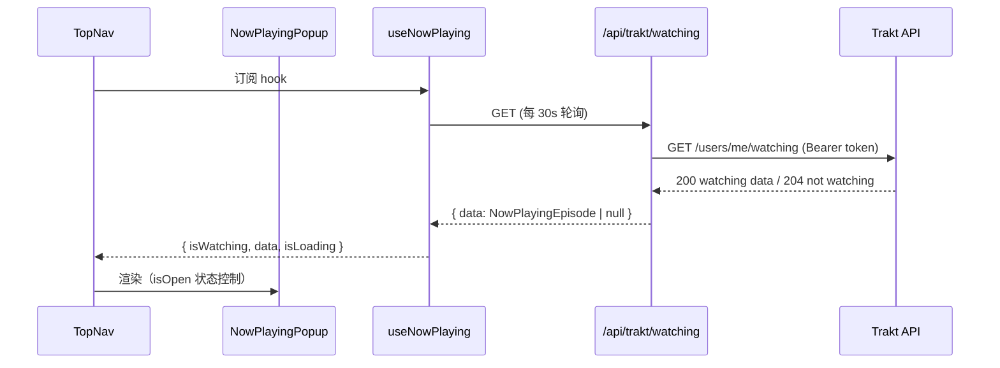
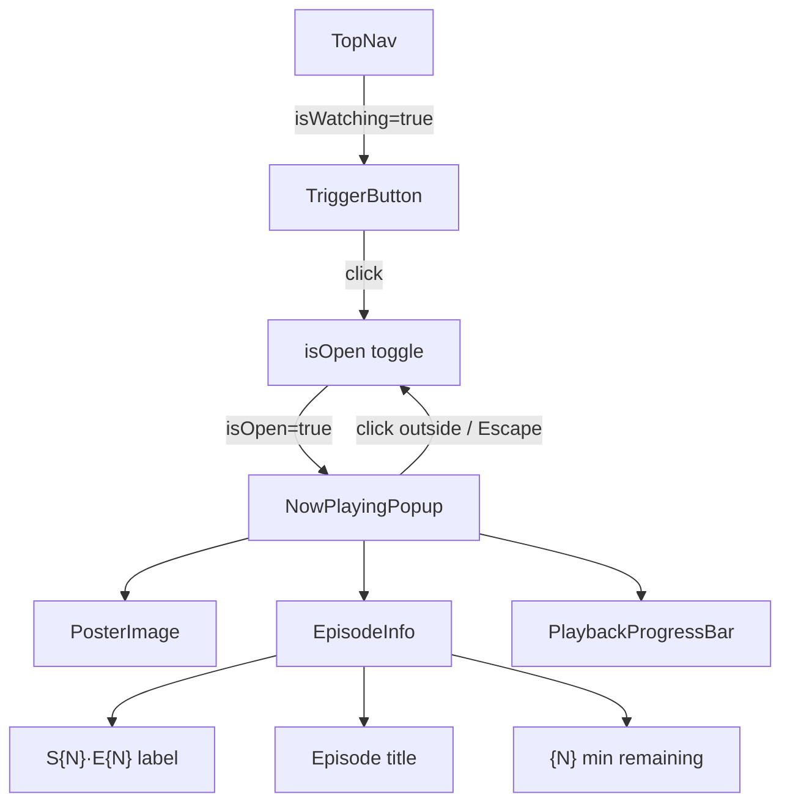

# Design Document: Now Playing Popup

## Overview

本功能在现有 trakt·dash Web 应用中新增一个"正在播放"浮层卡片。通过后端代理接口轮询 Trakt `/users/me/watching` 端点，将当前播放状态实时展示在导航栏触发按钮和弹出卡片中。

核心设计原则：
- 后端代理保护用户 token，前端不直接调用 Trakt API
- 使用 React Query 管理轮询与缓存，与现有 hooks 模式保持一致
- 组件完全使用项目已有 CSS 变量，无需引入新的设计 token
- 最小化对现有 `TopNav` 的侵入性修改

---

## Architecture





---

## Components and Interfaces

### 1. 后端路由：`apps/api/src/routes/trakt.ts`

新增 Hono 路由文件，注册到 `/api/trakt`。

```typescript
GET /api/trakt/watching
// 受 authMiddleware 保护
// 返回: { data: NowPlayingEpisode | null }
// 错误: 401 (未认证), 502 (Trakt API 失败)
```

路由调用 `getTraktClient()` 中新增的 `getWatching(userId)` 方法，该方法直接请求 Trakt `/users/me/watching?extended=full`。

### 2. Trakt 服务扩展：`apps/api/src/services/trakt.ts`

在 `getTraktClient()` 返回对象中新增：

```typescript
getWatching: (userId: number) => Promise<TraktWatchingResponse | null>
```

`TraktWatchingResponse` 是 Trakt API 原始响应的本地接口（仅在服务层使用），包含 `show`、`episode`、`expires_at`、`action` 字段。204 响应返回 `null`。

### 3. 类型定义：`packages/types/src/index.ts`

新增导出接口：

```typescript
export interface NowPlayingEpisode {
  show: {
    title: string
    posterPath: string | null
    traktSlug: string | null
  }
  episode: {
    seasonNumber: number
    episodeNumber: number
    title: string
  }
  expiresAt: string        // ISO 8601
  runtime: number | null   // 分钟
}
```

### 4. API 客户端：`apps/web/src/lib/api.ts`

在 `api` 对象中新增：

```typescript
trakt: {
  watching: () => request<ApiResponse<NowPlayingEpisode | null>>('/trakt/watching')
}
```

### 5. Hook：`apps/web/src/hooks/index.ts`

新增 `useNowPlaying` hook：

```typescript
export function useNowPlaying(): {
  data: NowPlayingEpisode | null
  isWatching: boolean
  isLoading: boolean
  error: Error | null
}
```

使用 `useQuery`，`refetchInterval: 30_000`，`staleTime: 25_000`。

### 6. 组件：`apps/web/src/components/NowPlayingPopup.tsx`

```typescript
interface NowPlayingPopupProps {
  data: NowPlayingEpisode | null
  isLoading: boolean
  isOpen: boolean
  onClose: () => void
}
```

固定定位浮层，使用 `framer-motion` 的 `AnimatePresence` + `motion.div` 实现淡入/上滑动画。

### 7. 修改：`apps/web/src/components/TopNav.tsx`

- 在组件内部调用 `useNowPlaying()`
- 当 `isWatching` 为 true 时，在导航右侧渲染触发按钮
- 管理 `isOpen` 本地状态，传递给 `NowPlayingPopup`

---

## Data Models

### Trakt API 原始响应（服务层内部）

```typescript
// apps/api/src/services/trakt.ts (内部类型，不导出到 packages/types)
interface TraktWatchingResponse {
  expires_at: string
  started_at: string
  action: 'watch'
  type: 'episode'
  episode: {
    season: number
    number: number
    title: string
    runtime: number | null
    ids: { trakt: number; tvdb: number; imdb: string; tmdb: number }
  }
  show: {
    title: string
    ids: { trakt: number; slug: string; tvdb: number; imdb: string; tmdb: number }
  }
}
```

### 后端响应到前端类型的映射

```
TraktWatchingResponse                →  NowPlayingEpisode
─────────────────────────────────────────────────────────
show.title                           →  show.title
show.ids.slug                        →  show.traktSlug
(TMDB poster via tmdb.ts service)    →  show.posterPath  (可选，见下方说明)
episode.season                       →  episode.seasonNumber
episode.number                       →  episode.episodeNumber
episode.title                        →  episode.title
expires_at                           →  expiresAt
episode.runtime                      →  runtime
```

**海报路径说明**：Trakt watching 响应不包含海报路径。后端路由将尝试从本地数据库（`shows` 表，按 `traktSlug` 查询）获取 `posterPath`。若未找到，返回 `null`，前端显示占位图标。这避免了额外的 TMDB API 调用。

### 前端进度计算

```typescript
// 在 NowPlayingPopup 组件内计算
const now = Date.now()
const expiresMs = new Date(expiresAt).getTime()
const remainingMinutes = Math.max(0, Math.round((expiresMs - now) / 60_000))

// 进度百分比（已播放 / 总时长）
const elapsedMinutes = runtime != null ? runtime - remainingMinutes : 0
const progressPct = runtime != null && runtime > 0
  ? Math.min(100, Math.max(0, (elapsedMinutes / runtime) * 100))
  : 0
```

---

## Correctness Properties

*A property is a characteristic or behavior that should hold true across all valid executions of a system — essentially, a formal statement about what the system should do. Properties serve as the bridge between human-readable specifications and machine-verifiable correctness guarantees.*

### Property 1: 后端响应包含 expires_at 字段

*For any* valid Trakt watching response (HTTP 200), the mapped `NowPlayingEpisode` object returned by the proxy must contain a non-empty `expiresAt` string.

**Validates: Requirements 1.6**

### Property 2: 剩余时间格式正确性

*For any* `expiresAt` ISO string and current timestamp where `expiresAt > now`, the computed remaining time label must match the pattern `{N} min remaining` where N is a non-negative integer equal to `Math.round((expiresAt - now) / 60_000)`.

**Validates: Requirements 3.5**

### Property 3: 播放进度百分比有界性

*For any* `runtime` (positive integer, minutes) and `expiresAt` timestamp, the computed `progressPct` must satisfy `0 ≤ progressPct ≤ 100`, and when `remainingMinutes ≥ runtime` the percentage must be 0, and when `remainingMinutes ≤ 0` the percentage must be 100.

**Validates: Requirements 3.6**

### Property 4: S·E 格式化正确性

*For any* `seasonNumber` and `episodeNumber` (positive integers), the formatted label must equal the string `S${seasonNumber}·E${episodeNumber}`.

**Validates: Requirements 3.3**

### Property 5: 海报加载失败时显示占位图

*For any* `NowPlayingEpisode` data, if the poster `` element fires an `onError` event, the component must render the placeholder icon and not the broken image element.

**Validates: Requirements 3.2**

### Property 6: 触发按钮可见性与 isWatching 状态一致

*For any* render of `TopNav`, the trigger button must be present in the DOM if and only if `isWatching` is `true`.

**Validates: Requirements 4.1, 4.6**

### Property 7: 点击触发按钮切换弹窗可见性

*For any* initial `isOpen` state (true or false), clicking the trigger button must result in `isOpen` being toggled to the opposite state.

**Validates: Requirements 4.2**

### Property 8: 错误时保留上次成功数据

*For any* sequence of: successful fetch returning data D, followed by a failed fetch, the hook must still expose `data === D` (last successful value is retained).

**Validates: Requirements 2.5**

---

## Error Handling

| 场景 | 后端行为 | 前端行为 |
|------|----------|----------|
| Trakt 返回 204（未在观看） | 返回 `{ data: null }` HTTP 200 | `isWatching: false`，隐藏触发按钮 |
| 用户未认证 | 返回 HTTP 401 | React Query 抛出错误，hook 暴露 `error`，不显示弹窗 |
| Trakt API 请求失败 | 返回 HTTP 502 + 错误描述 | React Query 保留上次成功数据（staleTime 内），`error` 字段非 null |
| 海报图片加载失败 | — | `onError` 触发，渲染 `<Tv2>` 占位图标 |
| `expiresAt` 已过期（remainingMinutes ≤ 0） | — | 显示 `0 min remaining`，进度条 100% |
| `runtime` 为 null | — | 进度条不渲染（或显示为 0%），仅显示剩余时间 |

---

## Testing Strategy

### 单元测试（具体示例与边界条件）

使用 Vitest + React Testing Library，与项目现有测试风格一致（参见 `apps/web/src/components/__tests__/`）。

**后端路由测试** (`apps/api/src/routes/__tests__/trakt.test.ts`)：
- 示例：Trakt 返回 204 → 响应为 `{ data: null }` HTTP 200（对应 Requirements 1.2/1.3）
- 示例：无 session token → HTTP 401（对应 Requirements 1.4）
- 示例：Trakt API 抛出异常 → HTTP 502（对应 Requirements 1.5）
- 示例：端点存在且可访问（对应 Requirements 1.1）

**Hook 测试** (`apps/web/src/hooks/__tests__/useNowPlaying.test.ts`)：
- 示例：data 为 null → `isWatching: false`（对应 Requirements 2.3）
- 示例：fetch 进行中 → `isLoading: true`（对应 Requirements 2.4）
- 示例：`refetchInterval` 配置为 30000ms（对应 Requirements 2.1）
- 示例：`staleTime` 配置为 25000ms（对应 Requirements 2.6）

**组件测试** (`apps/web/src/components/__tests__/NowPlayingPopup.test.tsx`)：
- 示例：渲染包含 "Now Playing" 标签（对应 Requirements 3.1）
- 示例：`isWatching: false` → 组件不在 DOM 中（对应 Requirements 3.7）
- 示例：`isLoading: true` + `data: null` → 渲染骨架屏（对应 Requirements 3.8）
- 示例：点击外部区域 → 弹窗关闭（对应 Requirements 4.3）
- 示例：按下 Escape → 弹窗关闭（对应 Requirements 4.4）
- 示例：`isWatching: true` → 触发按钮含脉冲动画元素（对应 Requirements 4.5）
- 示例：弹窗有 `position: fixed` 且 `z-index` 高于 TopNav（对应 Requirements 5.5）
- 示例：`NowPlayingEpisode` 类型可从 `@trakt-dashboard/types` 导入（对应 Requirements 6.1）

### 属性测试（Property-Based Testing）

使用 **fast-check**（TypeScript 生态主流 PBT 库，与 Vitest 集成良好）。每个属性测试运行最少 **100 次**迭代。

**测试文件**：`apps/web/src/lib/__tests__/nowPlaying.property.test.ts`

```
// Feature: now-playing-popup, Property 2: 剩余时间格式正确性
// Feature: now-playing-popup, Property 3: 播放进度百分比有界性
// Feature: now-playing-popup, Property 4: S·E 格式化正确性
```

**测试文件**：`apps/web/src/components/__tests__/NowPlayingPopup.property.test.tsx`

```
// Feature: now-playing-popup, Property 5: 海报加载失败时显示占位图
// Feature: now-playing-popup, Property 6: 触发按钮可见性与 isWatching 状态一致
// Feature: now-playing-popup, Property 7: 点击触发按钮切换弹窗可见性
```

**测试文件**：`apps/web/src/hooks/__tests__/useNowPlaying.property.test.ts`

```
// Feature: now-playing-popup, Property 8: 错误时保留上次成功数据
```

**测试文件**：`apps/api/src/routes/__tests__/trakt.property.test.ts`

```
// Feature: now-playing-popup, Property 1: 后端响应包含 expires_at 字段
```

每个属性测试的 fast-check 配置：

```typescript
fc.assert(fc.property(...arbitraries, (...args) => {
  // property body
}), { numRuns: 100 })
```
