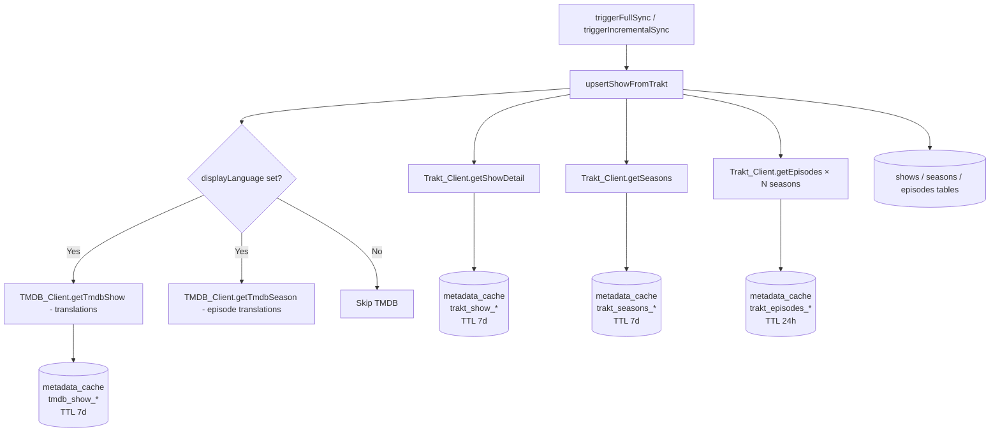

# Design Document: trakt-primary-datasource

## Overview

本设计将 Trakt API 提升为剧集元数据的主数据源，TMDB 降级为翻译补充源。核心动机是 Trakt 提供完整的 TBA（To Be Announced）集数条目和更准确的 Specials（Season 0）数据，而 TMDB 不提前返回未来集数据。

重构范围：
- **`apps/api/src/services/trakt.ts`**：新增 `getShowDetail`、`getSeasons`、`getEpisodes` 三个方法，复用现有 `traktFetch` 基础设施和 `metadata_cache` 缓存机制
- **`apps/api/src/services/sync.ts`**：新增 `upsertShowFromTrakt`，替换 `upsertShowFromTmdb` 作为主 upsert 函数；TMDB 调用仅在 `displayLanguage` 非空时执行

关键约束：
- 无数据库 schema 变更，无迁移文件
- `shows.tmdbId` 唯一索引保持不变（从 Trakt `ids.tmdb` 取值）
- 现有并发控制（`SHOW_CONCURRENCY=5`、`SEASON_CONCURRENCY=4`）和重试逻辑不变

---

## Architecture

### 数据流（重构后）



### 与现有架构的对比

| 方面 | 重构前 | 重构后 |
|------|--------|--------|
| Show 元数据主源 | TMDB (`getTmdbShow`) | Trakt (`getShowDetail`) |
| Season 结构主源 | TMDB (`tmdb.seasons`) | Trakt (`getSeasons`) |
| Episode 列表主源 | TMDB (`getTmdbSeason`) | Trakt (`getEpisodes`) |
| TBA 集数支持 | ❌ TMDB 不返回 | ✅ Trakt 包含 null first_aired |
| Specials (S0) | 部分支持 | ✅ Trakt 更准确 |
| 图片（poster/backdrop） | TMDB | TMDB（保持不变） |
| 翻译标题/简介 | TMDB（始终调用） | TMDB（仅 displayLanguage 非空时） |

---

## Components and Interfaces

### 1. Trakt_Client 新增方法

在 `getTraktClient()` 返回对象中新增三个方法：

#### `getShowDetail(traktId: number, userId: number): Promise<TraktShowDetail>`

调用 `GET /shows/{traktId}?extended=full`，返回 show 完整元数据。

#### `getSeasons(traktId: number, userId: number): Promise<TraktSeasonDetail[]>`

调用 `GET /shows/{traktId}/seasons?extended=full`，返回所有季（含 Season 0）。

#### `getEpisodes(traktId: number, seasonNumber: number, userId: number): Promise<TraktEpisodeDetail[]>`

调用 `GET /shows/{traktId}/seasons/{seasonNumber}/episodes?extended=full`，返回该季所有集（含 TBA）。

### 2. 新增 TypeScript 接口

```typescript
// 新增到 trakt.ts

export interface TraktShowDetail {
  title: string
  year: number | null
  overview: string | null
  status: string | null
  first_aired: string | null
  network: string | null
  genres: string[]
  ids: {
    trakt: number
    slug: string
    tvdb: number | null
    imdb: string | null
    tmdb: number | null
  }
}

export interface TraktSeasonDetail {
  number: number
  episode_count: number
  first_aired: string | null
  overview: string | null
  ids: {
    trakt: number
    tvdb: number | null
    tmdb: number | null
  }
}

export interface TraktEpisodeDetail {
  number: number
  season: number
  title: string | null
  overview: string | null
  first_aired: string | null
  runtime: number | null
  ids: {
    trakt: number
    tvdb: number | null
    imdb: string | null
    tmdb: number | null
  }
}
```

### 3. Sync_Service 新增函数

#### `upsertShowFromTrakt(traktId, traktShow, userId): Promise<number>`

替代 `upsertShowFromTmdb`，以 Trakt 为主源写入 shows/seasons/episodes 表。内部流程：

1. 读取 `userSettings.displayLanguage`
2. 调用 `getShowDetail(traktId)` 获取 show 元数据
3. 若 `ids.tmdb` 为 null，抛出错误（记录为失败项）
4. 若 `displayLanguage` 非空，调用 `getTmdbShow` 获取翻译数据和图片
5. Upsert `shows` 表（`onConflictDoUpdate` target: `shows.tmdbId`）
6. 调用 `getSeasons(traktId)` 获取季列表
7. 并发（`SEASON_CONCURRENCY`）对每季调用 `getEpisodes`，upsert `seasons` 和 `episodes` 表
8. 若 `displayLanguage` 非空，并发调用 `getTmdbSeason` 获取集翻译数据

---

## Data Models

### shows 表写入映射（重构后）

| 字段 | 来源 | 说明 |
|------|------|------|
| `tmdbId` | `traktDetail.ids.tmdb` | 必须非空，维持唯一索引 |
| `traktId` | `traktDetail.ids.trakt` | |
| `traktSlug` | `traktDetail.ids.slug` | |
| `tvdbId` | `traktDetail.ids.tvdb` | |
| `imdbId` | `traktDetail.ids.imdb` | |
| `title` | `traktDetail.title` | Trakt 原始标题 |
| `overview` | `traktDetail.overview` | Trakt 原始简介 |
| `status` | `traktDetail.status?.toLowerCase()` | |
| `firstAired` | `traktDetail.first_aired` | |
| `network` | `traktDetail.network` | |
| `genres` | `traktDetail.genres` | |
| `posterPath` | `tmdbShow.poster_path` | 仅 TMDB 提供图片 |
| `backdropPath` | `tmdbShow.backdrop_path` | 仅 TMDB 提供图片 |
| `totalSeasons` | `traktSeasons.length` | |
| `totalEpisodes` | `sum(season.episode_count)` | |
| `originalName` | `traktDetail.title` | Trakt 无 original_name，使用 title |
| `translatedName` | `tmdbShow.name`（若与 title 不同） | 仅 displayLanguage 非空时 |
| `translatedOverview` | `tmdbShow.overview`（若与 overview 不同） | 仅 displayLanguage 非空时 |
| `displayLanguage` | `userSettings.displayLanguage` | |

### episodes 表写入映射（重构后）

| 字段 | 来源 | 说明 |
|------|------|------|
| `traktId` | `traktEpisode.ids.trakt` | 始终写入 |
| `tmdbId` | `traktEpisode.ids.tmdb` | 可为 null |
| `title` | `traktEpisode.title` | TBA 时为 null |
| `overview` | `traktEpisode.overview` | TBA 时为 null |
| `airDate` | `traktEpisode.first_aired` | TBA 时为 null |
| `runtime` | `traktEpisode.runtime` | TBA 时为 null |
| `translatedTitle` | `tmdbEpisode.name`（若不同） | 仅 displayLanguage 非空时 |
| `translatedOverview` | `tmdbEpisode.overview`（若不同） | 仅 displayLanguage 非空时 |

### 缓存键规范

| 数据类型 | source 字段 | externalId 格式 | TTL |
|----------|-------------|-----------------|-----|
| Show 详情 | `trakt_show` | `trakt_show_{traktId}` | 7 天 |
| Seasons 列表 | `trakt_seasons` | `trakt_seasons_{traktId}` | 7 天 |
| Episodes 列表 | `trakt_episodes` | `trakt_episodes_{traktId}_s{seasonNumber}` | 24 小时 |

---

## Correctness Properties

*A property is a characteristic or behavior that should hold true across all valid executions of a system—essentially, a formal statement about what the system should do. Properties serve as the bridge between human-readable specifications and machine-verifiable correctness guarantees.*

### Property 1: Trakt API 方法返回结构完整的对象

*For any* valid traktId，调用 `getShowDetail`、`getSeasons`、`getEpisodes` 时，返回对象中所有必需字段（`title`、`ids`、`number` 等）均应存在，可为 null 的字段（`overview`、`first_aired`、`runtime`）允许为 null。

**Validates: Requirements 1.1, 2.1, 3.1**

### Property 2: 非 200 状态码始终抛出错误

*For any* HTTP 状态码不为 200 的响应（如 400、401、403、404、500），`getShowDetail`、`getSeasons`、`getEpisodes` 均应抛出包含状态码信息的错误，不返回 undefined 或空对象。

**Validates: Requirements 1.2, 2.4, 3.4**

### Property 3: 缓存命中时不发起网络请求（幂等性）

*For any* traktId，连续两次调用同一 Trakt 方法（`getShowDetail`/`getSeasons`/`getEpisodes`），第二次调用不应触发网络请求，应直接返回缓存数据，且两次返回值相等。

**Validates: Requirements 1.4, 8.3**

### Property 4: 缓存写入使用正确的键格式

*For any* traktId 和 seasonNumber，调用 Trakt 方法后，`metadata_cache` 表中应存在对应行，`source` 和 `externalId` 字段符合规范（`trakt_show_{id}`、`trakt_seasons_{id}`、`trakt_episodes_{id}_s{n}`）。

**Validates: Requirements 1.3, 2.3, 3.3, 8.1, 8.4**

### Property 5: Season 0（Specials）不被过滤

*For any* 包含 `number === 0` 条目的 Trakt seasons 响应，`getSeasons` 返回的数组中应包含该条目，不得过滤。

**Validates: Requirements 2.2**

### Property 6: TBA 集数不被过滤

*For any* 包含 `first_aired === null` 条目的 Trakt episodes 响应，`getEpisodes` 返回的数组中应包含该条目，不得过滤。

**Validates: Requirements 3.2**

### Property 7: upsertShowFromTrakt 写入 shows 表时 tmdbId 非空

*For any* 包含非空 `ids.tmdb` 的 Trakt show，调用 `upsertShowFromTrakt` 后，`shows` 表中对应行的 `tmdbId` 应等于 `traktDetail.ids.tmdb`，不得为 null。

**Validates: Requirements 4.7, 9.1**

### Property 8: TBA 集数以 null 字段写入 episodes 表

*For any* `first_aired` 为 null 的 Trakt episode，`upsertShowFromTrakt` 写入 `episodes` 表后，对应行的 `airDate`、`title`、`overview` 应为 null，`traktId` 应等于 `traktEpisode.ids.trakt`。

**Validates: Requirements 4.5, 9.2**

### Property 9: displayLanguage 为空时跳过所有 TMDB 调用

*For any* `displayLanguage` 为 null 或空字符串的用户，`upsertShowFromTrakt` 执行过程中不应调用 `getTmdbShow` 或 `getTmdbSeason`。

**Validates: Requirements 5.5**

### Property 10: TMDB 翻译仅在标题/简介不同时写入

*For any* (traktTitle, tmdbTitle) 对，若两者相同则 `shows.translatedName` 应为 null；若不同则 `shows.translatedName` 应等于 tmdbTitle。`translatedOverview` 遵循相同规则。

**Validates: Requirements 5.2, 5.3**

### Property 11: TMDB 失败不中断同步流程

*For any* TMDB API 调用失败（抛出任意错误），`upsertShowFromTrakt` 应完成执行并返回 show id，不向上抛出 TMDB 错误。

**Validates: Requirements 5.6**

### Property 12: ids.tmdb 为 null 的 show 记录为失败项

*For any* `ids.tmdb` 为 null 的 Trakt show，`upsertShowFromTrakt` 应抛出错误（由调用方记录到 `failureMap`），错误信息包含 `'Missing TMDB id'`。

**Validates: Requirements 9.5**

---

## Error Handling

### 错误分类与处理策略

| 错误场景 | 处理方式 | 影响范围 |
|----------|----------|----------|
| Trakt API 非 200 | 抛出错误，由 `syncSingleShow` 捕获记录到 `failureMap` | 单个 show 失败，不影响其他 show |
| `ids.tmdb` 为 null | 抛出 `'Missing TMDB id'` 错误 | 单个 show 失败 |
| TMDB 翻译调用失败 | `console.warn` + 继续执行，`translatedName`/`translatedOverview` 保持 null | 无，降级处理 |
| `getEpisodes` 失败（单季） | `console.warn` + 跳过该季，与现有 `getTmdbSeason` 失败处理一致 | 单季 episodes 缺失 |
| `findOrCreateEpisode` 中 Trakt 调用失败 | 返回 null，与现有行为一致 | 单个 episode 创建失败 |
| 缓存读写失败 | 不捕获，让错误向上传播（DB 连接问题应暴露） | 整个 show 同步失败 |

### 失败重试逻辑（保持不变）

现有的 `FAILED_RETRY_MAX = 2` 重试机制和 `pLimit(2)` 重试并发控制保持不变，`upsertShowFromTrakt` 的失败会被同样的重试逻辑处理。

---

## Testing Strategy

### 单元测试（example-based）

**`trakt.ts` 新方法测试：**
- `getShowDetail` 返回正确结构的对象（mock HTTP 响应）
- `getShowDetail` 在非 200 时抛出错误
- `getSeasons` 包含 season 0
- `getEpisodes` 包含 null first_aired 的 TBA 集

**`sync.ts` 行为测试：**
- `triggerFullSync` 调用 `upsertShowFromTrakt` 而非 `upsertShowFromTmdb`
- `triggerIncrementalSync` 调用 `upsertShowFromTrakt` 而非 `upsertShowFromTmdb`
- `findOrCreateEpisode` 调用 Trakt 而非 TMDB 获取缺失集
- `findOrCreateEpisode` 在 Trakt 失败时返回 null

### 属性测试（property-based）

使用 **fast-check**（TypeScript 生态主流 PBT 库）实现以下属性测试，每个测试最少运行 100 次迭代。

每个属性测试使用注释标注：
```
// Feature: trakt-primary-datasource, Property N: <property_text>
```

**需要实现的属性测试：**

| 属性 | 生成器 | 验证点 |
|------|--------|--------|
| Property 2: 非 200 抛出错误 | `fc.integer({ min: 400, max: 599 })` | 每个状态码都抛出错误 |
| Property 3: 缓存命中幂等性 | `fc.integer({ min: 1 })` (traktId) | 第二次调用不触发 fetch |
| Property 4: 缓存键格式 | `fc.integer`, `fc.integer` (traktId, seasonNum) | externalId 符合格式规范 |
| Property 5: Season 0 不过滤 | `fc.array` 含 number=0 的 season | 返回数组包含 season 0 |
| Property 6: TBA 不过滤 | `fc.array` 含 null first_aired 的 episode | 返回数组包含 TBA 集 |
| Property 7: tmdbId 非空写入 | `fc.integer` (tmdbId) | shows.tmdbId 等于输入值 |
| Property 8: TBA 字段为 null | TBA episode 生成器 | airDate/title/overview 为 null，traktId 非空 |
| Property 9: 无 displayLanguage 跳过 TMDB | `fc.constant(null)` | getTmdbShow 调用次数为 0 |
| Property 10: 翻译条件写入 | `fc.tuple(fc.string, fc.string)` | 相同时 null，不同时写入 |
| Property 11: TMDB 失败不中断 | mock TMDB throw | upsertShowFromTrakt 正常返回 |
| Property 12: null tmdbId 记录失败 | show with null ids.tmdb | 抛出含 'Missing TMDB id' 的错误 |

### 集成测试

- 完整 sync 流程端到端测试（使用 Trakt/TMDB mock server）
- 验证 TBA 集数在 DB 中正确存储
- 验证 Season 0 在 DB 中正确存储
