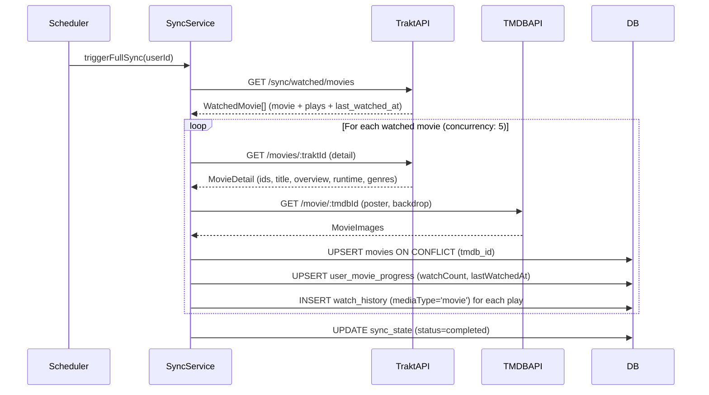

# Design Document: TV Shows and Movies Separation

## Overview

This feature separates TV shows and movies into distinct pages within the Trakt Dashboard. The existing `ProgressPage` is renamed to `TVShowsPage` (route `/tv-shows`), and a new `MoviesPage` is added at `/movies`. Both pages share the same visual design language but operate on independent data models.

Key design decisions:

- **Independent data models**: `movies` table is separate from `shows` — no shared base table. Movies have fundamentally different metadata (no seasons/episodes, runtime per film, etc.).
- **Extended `watchHistory`**: A `movieId` (nullable) column and a `mediaType` column (`episode` | `movie`) are added to the existing table, avoiding a separate movie-history table and keeping history queries uniform.
- **`userMovieProgress` materialized cache**: Mirrors `userShowProgress` pattern — stores `watchCount` and `lastWatchedAt` per user/movie for fast list queries.
- **Trakt as primary source**: Movie data is fetched from Trakt `/sync/watched/movies`; TMDB provides posters and backdrops.

---

## Architecture

```mermaid
graph TD
    subgraph Frontend
        A[App.tsx / Router] --> B[TVShowsPage]
        A --> C[MoviesPage]
        A --> D[MovieDetailPage]
        B --> E[ShowCard]
        C --> F[MovieCard]
        D --> G[WatchHistoryPanel]
        B --> H[useShowsProgress]
        C --> I[useMoviesProgress]
        D --> J[useMovieDetail / useMovieHistory]
    end

    subgraph API Layer
        K[/api/shows/*] --> L[shows.ts route]
        M[/api/movies/*] --> N[movies.ts route]
    end

    subgraph Services
        O[sync.ts] --> P[trakt.ts]
        O --> Q[tmdb.ts]
        N --> R[DB: movies + userMovieProgress]
        L --> S[DB: shows + userShowProgress]
        R --> T[watchHistory mediaType=movie]
        S --> U[watchHistory mediaType=episode]
    end

    H --> K
    I --> M
    J --> M
```

The architecture mirrors the existing TV shows pattern exactly. The `movies.ts` route file is a peer of `shows.ts`. The sync service gains a `syncMovies()` function alongside the existing show sync path.


---

## Components and Interfaces

### Renamed / Modified Components

| Before | After | Change |
|--------|-------|--------|
| `ProgressPage.tsx` | `TVShowsPage.tsx` | File rename; route `/progress` → `/tv-shows` |
| `TopNav` NAV array | Add Movies entry | Insert `{ to: '/movies', icon: Film, labelKey: 'nav.movies' }` after TV Shows |
| `App.tsx` routes | Update paths | `/progress` → `/tv-shows`; add `/movies`, `/movies/:id` |

### New Components

#### `MoviesPage`

```typescript
// apps/web/src/pages/MoviesPage.tsx
interface MoviesPageProps {} // no props — reads from URL query params

// Internal state
const [filter, setFilter] = useState<'watched' | 'unwatched' | 'all'>('watched')
const [search, setSearch] = useState('')
// Debounced search (280ms) — same pattern as TVShowsPage
```

Filter tabs: `watched` (icon: `Eye`), `unwatched` (icon: `EyeOff`), `all` (icon: `LayoutGrid`).

#### `MovieCard`

```typescript
// apps/web/src/components/MovieCard.tsx
interface MovieCardProps {
  movie: MovieProgress   // from @trakt-dashboard/types
  index: number          // for staggered animation delay
}
```

Displays: poster image, title, watch count badge (`Watched N times` / `Not watched`), last watched date. Links to `/movies/:id`. Uses identical hover/transition styles as `ShowCard`.

#### `MovieDetailPage`

```typescript
// apps/web/src/pages/MovieDetailPage.tsx
// Route: /movies/:id
// Displays: backdrop hero, poster, title, overview, release date, runtime, genres
// Sections: watch history list, mark-as-watched button
```

### Type Definitions (packages/types)

```typescript
// New types to add to @trakt-dashboard/types

export interface Movie {
  id: number
  tmdbId: number
  imdbId: string | null
  traktId: number | null
  title: string
  overview: string | null
  releaseDate: string | null   // YYYY-MM-DD
  runtime: number | null       // minutes
  posterPath: string | null
  backdropPath: string | null
  genres: string[]
  lastSyncedAt: string
  createdAt: string
}

export interface MovieProgress {
  movie: Movie
  watchCount: number
  lastWatchedAt: string | null
}

export interface MovieWatchHistoryEntry {
  id: number
  movieId: number
  watchedAt: string | null
  source: string
}
```


---

## Data Models

### Database Schema Changes

#### Migration: `0004_movies.sql`

```sql
-- 1. Add mediaType + movieId to watchHistory
ALTER TABLE watch_history
  ADD COLUMN media_type TEXT NOT NULL DEFAULT 'episode',
  ADD COLUMN movie_id INTEGER REFERENCES movies(id) ON DELETE CASCADE;

-- Backfill existing rows
UPDATE watch_history SET media_type = 'episode' WHERE media_type = 'episode';

-- 2. Relax NOT NULL on episode_id (movies have no episode)
ALTER TABLE watch_history ALTER COLUMN episode_id DROP NOT NULL;

-- 3. New movies table
CREATE TABLE movies (
  id            SERIAL PRIMARY KEY,
  tmdb_id       INTEGER NOT NULL UNIQUE,
  imdb_id       TEXT,
  trakt_id      INTEGER,
  trakt_slug    TEXT,
  title         TEXT NOT NULL,
  overview      TEXT,
  release_date  TEXT,
  runtime       INTEGER,
  poster_path   TEXT,
  backdrop_path TEXT,
  genres        JSONB NOT NULL DEFAULT '[]',
  last_synced_at TIMESTAMPTZ NOT NULL DEFAULT NOW(),
  created_at    TIMESTAMPTZ NOT NULL DEFAULT NOW()
);

CREATE INDEX movies_trakt_id_idx ON movies(trakt_id);
CREATE INDEX movies_imdb_id_idx  ON movies(imdb_id);

-- 4. userMovieProgress materialized cache
CREATE TABLE user_movie_progress (
  id              SERIAL PRIMARY KEY,
  user_id         INTEGER NOT NULL REFERENCES users(id) ON DELETE CASCADE,
  movie_id        INTEGER NOT NULL REFERENCES movies(id) ON DELETE CASCADE,
  watch_count     INTEGER NOT NULL DEFAULT 0,
  last_watched_at TIMESTAMPTZ,
  updated_at      TIMESTAMPTZ NOT NULL DEFAULT NOW()
);

CREATE UNIQUE INDEX ump_user_movie_idx ON user_movie_progress(user_id, movie_id);
CREATE INDEX        ump_user_idx       ON user_movie_progress(user_id);

-- 5. Index for movie watch history lookups
CREATE INDEX watch_history_movie_idx ON watch_history(movie_id);
```

### Drizzle Schema Additions (`packages/db/src/schema.ts`)

```typescript
// Extended watchHistory table
export const watchHistory = pgTable('watch_history', {
  // ... existing columns ...
  episodeId: integer('episode_id').references(() => episodes.id, { onDelete: 'cascade' }),  // now nullable
  movieId:   integer('movie_id').references(() => movies.id, { onDelete: 'cascade' }),      // new
  mediaType: text('media_type').notNull().default('episode'),                                // new: 'episode' | 'movie'
}, (t) => [
  // ... existing indexes ...
  index('watch_history_movie_idx').on(t.movieId),
])

export const movies = pgTable('movies', {
  id:           serial('id').primaryKey(),
  tmdbId:       integer('tmdb_id').notNull().unique(),
  imdbId:       text('imdb_id'),
  traktId:      integer('trakt_id'),
  traktSlug:    text('trakt_slug'),
  title:        text('title').notNull(),
  overview:     text('overview'),
  releaseDate:  text('release_date'),
  runtime:      integer('runtime'),
  posterPath:   text('poster_path'),
  backdropPath: text('backdrop_path'),
  genres:       jsonb('genres').$type<string[]>().notNull().default([]),
  lastSyncedAt: timestamp('last_synced_at', { withTimezone: true }).defaultNow().notNull(),
  createdAt:    timestamp('created_at', { withTimezone: true }).defaultNow().notNull(),
}, (t) => [
  index('movies_trakt_id_idx').on(t.traktId),
  index('movies_imdb_id_idx').on(t.imdbId),
])

export const userMovieProgress = pgTable('user_movie_progress', {
  id:            serial('id').primaryKey(),
  userId:        integer('user_id').notNull().references(() => users.id, { onDelete: 'cascade' }),
  movieId:       integer('movie_id').notNull().references(() => movies.id, { onDelete: 'cascade' }),
  watchCount:    integer('watch_count').notNull().default(0),
  lastWatchedAt: timestamp('last_watched_at', { withTimezone: true }),
  updatedAt:     timestamp('updated_at', { withTimezone: true }).defaultNow().notNull(),
}, (t) => [
  uniqueIndex('ump_user_movie_idx').on(t.userId, t.movieId),
  index('ump_user_idx').on(t.userId),
])
```

### Data Invariants

- `watchHistory.episodeId` is non-null when `mediaType = 'episode'`
- `watchHistory.movieId` is non-null when `mediaType = 'movie'`
- `userMovieProgress.watchCount` equals the count of `watchHistory` rows where `movieId = movie_id AND userId = user_id AND mediaType = 'movie'`


---

## Backend API Design

All movie routes are defined in `apps/api/src/routes/movies.ts` and mounted at `/api/movies` in `index.ts`.

### Route Summary

| Method | Path | Description |
|--------|------|-------------|
| GET | `/api/movies/progress` | Paginated movie list with watch progress |
| GET | `/api/movies/:id` | Single movie detail |
| GET | `/api/movies/:id/history` | Watch history for a movie |
| POST | `/api/movies/:id/watch` | Record a watch event |
| DELETE | `/api/movies/:id/history/:historyId` | Remove a watch history record |

### GET `/api/movies/progress`

Query params: `filter` (`watched` | `unwatched` | `all`, default `watched`), `q` (search string), `limit` (1–200, default 50), `offset` (≥0, default 0).

```typescript
// Response shape
{
  data: MovieProgress[],
  total: number,
  limit: number,
  offset: number
}
```

Filter logic (mirrors shows.ts pattern):
```typescript
const whereClause = and(
  eq(userMovieProgress.userId, userId),
  search ? like(movies.title, `%${search}%`) : undefined,
  filter === 'watched'   ? gt(userMovieProgress.watchCount, 0) : undefined,
  filter === 'unwatched' ? eq(userMovieProgress.watchCount, 0) : undefined,
)
```

### GET `/api/movies/:id`

Returns `{ data: MovieProgress }`. 404 if movie not found or user has no progress record.

### GET `/api/movies/:id/history`

Returns `{ data: MovieWatchHistoryEntry[] }` ordered by `watched_at DESC NULLS LAST`.

### POST `/api/movies/:id/watch`

Body: `{ watchedAt: string | null }`. Inserts into `watchHistory` with `mediaType = 'movie'`, then calls `recalcMovieProgress(userId, movieId)`. Returns `{ ok: true, historyId: number }` with status 201.

### DELETE `/api/movies/:id/history/:historyId`

Verifies ownership (userId + movieId match), deletes the record, calls `recalcMovieProgress`. Returns `{ ok: true }`.

### `recalcMovieProgress` helper

```typescript
async function recalcMovieProgress(userId: number, movieId: number) {
  const db = getDb()
  const [{ count, lastWatched }] = await db
    .select({
      count: sql<number>`count(*)`,
      lastWatched: sql<Date | null>`max(watched_at)`,
    })
    .from(watchHistory)
    .where(and(
      eq(watchHistory.userId, userId),
      eq(watchHistory.movieId, movieId),
      eq(watchHistory.mediaType, 'movie'),
    ))

  await db
    .insert(userMovieProgress)
    .values({ userId, movieId, watchCount: Number(count), lastWatchedAt: lastWatched })
    .onConflictDoUpdate({
      target: [userMovieProgress.userId, userMovieProgress.movieId],
      set: { watchCount: Number(count), lastWatchedAt: lastWatched, updatedAt: new Date() },
    })
}
```


---

## Frontend Design

### Routing (`App.tsx`)

```typescript
// Before
<Route path="/progress" element={<ProgressPage />} />
<Route path="/" element={<Navigate to="/progress" replace />} />

// After
<Route path="/tv-shows" element={<TVShowsPage />} />
<Route path="/movies" element={<MoviesPage />} />
<Route path="/movies/:id" element={<MovieDetailPage />} />
<Route path="/" element={<Navigate to="/tv-shows" replace />} />
// Keep /progress redirect for backward compatibility
<Route path="/progress" element={<Navigate to="/tv-shows" replace />} />
```

### Navigation (`TopNav.tsx`)

```typescript
import { Tv2, Film, BarChart3, RefreshCw, Settings } from 'lucide-react'

const NAV = [
  { to: '/tv-shows', icon: Tv2,      labelKey: 'nav.tvShows' },
  { to: '/movies',   icon: Film,     labelKey: 'nav.movies' },
  { to: '/stats',    icon: BarChart3, labelKey: 'nav.statistics' },
  { to: '/sync',     icon: RefreshCw, labelKey: 'nav.sync' },
  { to: '/settings', icon: Settings,  labelKey: 'nav.settings' },
]
```

Active detection: `location.pathname.startsWith(to)` — unchanged logic.

### API Client (`lib/api.ts`)

```typescript
movies: {
  progress: (filter = 'watched', q = '', limit = 50, offset = 0) => {
    const params = new URLSearchParams({ filter, q, limit: String(limit), offset: String(offset) })
    return request<PaginatedResponse<MovieProgress>>(`/movies/progress?${params}`)
  },
  detail: (id: number) =>
    request<ApiResponse<MovieProgress>>(`/movies/${id}`),
  history: (id: number) =>
    request<ApiResponse<MovieWatchHistoryEntry[]>>(`/movies/${id}/history`),
  watch: (id: number, watchedAt: string | null) =>
    request<{ ok: boolean; historyId: number }>(`/movies/${id}/watch`, {
      method: 'POST',
      body: JSON.stringify({ watchedAt }),
    }),
  deleteHistory: (id: number, historyId: number) =>
    request<{ ok: boolean }>(`/movies/${id}/history/${historyId}`, { method: 'DELETE' }),
},
```

### React Query Hooks (`hooks/index.ts`)

```typescript
export function useMoviesProgress(filter: string, search: string, limit = 50, offset = 0) {
  return useQuery<MovieProgress[]>({
    queryKey: ['movies-progress', filter, search, limit, offset],
    queryFn: () => api.movies.progress(filter, search, limit, offset).then(r => r.data),
    staleTime: 1000 * 60,
  })
}

export function useMovieDetail(id: number) {
  return useQuery<MovieProgress>({
    queryKey: ['movie-detail', id],
    queryFn: () => api.movies.detail(id).then(r => r.data),
    enabled: id > 0,
  })
}

export function useMovieHistory(id: number) {
  return useQuery<MovieWatchHistoryEntry[]>({
    queryKey: ['movie-history', id],
    queryFn: () => api.movies.history(id).then(r => r.data),
    enabled: id > 0,
  })
}

export function useMarkMovieWatched(id: number) {
  const qc = useQueryClient()
  return useMutation({
    mutationFn: (watchedAt: string | null) => api.movies.watch(id, watchedAt),
    onSuccess: () => {
      qc.invalidateQueries({ queryKey: ['movie-detail', id] })
      qc.invalidateQueries({ queryKey: ['movie-history', id] })
      qc.invalidateQueries({ queryKey: ['movies-progress'] })
    },
  })
}

export function useDeleteMovieHistory(id: number) {
  const qc = useQueryClient()
  return useMutation({
    mutationFn: (historyId: number) => api.movies.deleteHistory(id, historyId),
    onSuccess: () => {
      qc.invalidateQueries({ queryKey: ['movie-history', id] })
      qc.invalidateQueries({ queryKey: ['movie-detail', id] })
      qc.invalidateQueries({ queryKey: ['movies-progress'] })
    },
  })
}
```


---

## Data Flow: Trakt Movie Sync



### `syncMovies` function (new in `sync.ts`)

```typescript
export async function syncMovies(userId: number): Promise<void> {
  const trakt = getTraktClient()
  const watchedMovies = await trakt.getWatchedMovies(userId)
  // trakt.getWatchedMovies → GET /sync/watched/movies
  // Returns: Array<{ movie: { title, ids: { trakt, tmdb, imdb, slug } }, plays, last_watched_at, watched_at }>

  const limit = pLimit(SHOW_CONCURRENCY)  // reuse same concurrency constant
  await Promise.all(watchedMovies.map(wm => limit(async () => {
    const tmdbId = wm.movie.ids.tmdb
    if (!tmdbId) return

    // Fetch TMDB images
    let posterPath: string | null = null
    let backdropPath: string | null = null
    try {
      const tmdbMovie = await getTmdbMovie(tmdbId, userId)
      posterPath = tmdbMovie.poster_path || null
      backdropPath = tmdbMovie.backdrop_path || null
    } catch { /* degrade gracefully */ }

    // Upsert movie record
    const [movie] = await db.insert(movies).values({
      tmdbId,
      traktId: wm.movie.ids.trakt,
      traktSlug: wm.movie.ids.slug,
      imdbId: wm.movie.ids.imdb,
      title: wm.movie.title,
      // overview, runtime, releaseDate from Trakt movie detail
      posterPath,
      backdropPath,
      lastSyncedAt: new Date(),
    }).onConflictDoUpdate({ target: [movies.tmdbId], set: { /* all fields */ } })
      .returning({ id: movies.id })

    // Upsert progress summary
    await db.insert(userMovieProgress).values({
      userId,
      movieId: movie.id,
      watchCount: wm.plays,
      lastWatchedAt: wm.last_watched_at ? new Date(wm.last_watched_at) : null,
    }).onConflictDoUpdate({
      target: [userMovieProgress.userId, userMovieProgress.movieId],
      set: { watchCount: wm.plays, lastWatchedAt: wm.last_watched_at ? new Date(wm.last_watched_at) : null },
    })

    // Insert individual watch events (dedup by traktPlayId not available for movies — use upsert on userId+movieId+watchedAt)
    // Trakt /sync/watched/movies does not return individual play timestamps beyond last_watched_at
    // For per-play history, use /sync/history/movies which returns individual entries
  })))
}
```

**Note on play history granularity**: Trakt's `/sync/watched/movies` returns aggregate `plays` count and `last_watched_at`. For individual timestamps, the sync service should also call `/sync/history/movies` (same pattern as the incremental show sync using `/sync/history`). The `watchHistory` rows are deduplicated using a composite unique index on `(userId, movieId, watchedAt)`.


---

## Internationalization

### New keys to add to both locale files

**`zh-CN.json`**:
```json
{
  "nav": {
    "tvShows": "电视节目",
    "movies": "电影"
  },
  "movies": {
    "watched": "已观看",
    "unwatched": "未观看",
    "watchCount": "观看次数",
    "watchedNTimes": "已观看 {{count}} 次",
    "notWatched": "未观看",
    "lastWatched": "最后观看"
  }
}
```

**`en-US.json`**:
```json
{
  "nav": {
    "tvShows": "TV Shows",
    "movies": "Movies"
  },
  "movies": {
    "watched": "Watched",
    "unwatched": "Unwatched",
    "watchCount": "Watch Count",
    "watchedNTimes": "Watched {{count}} times",
    "notWatched": "Not watched",
    "lastWatched": "Last watched"
  }
}
```

The existing `nav.progress` key is kept for backward compatibility but no longer used in the nav. The `progress.*` keys remain unchanged for the TV Shows page filters.


---

## Correctness Properties

*A property is a characteristic or behavior that should hold true across all valid executions of a system — essentially, a formal statement about what the system should do. Properties serve as the bridge between human-readable specifications and machine-verifiable correctness guarantees.*

### Property Reflection

Before writing properties, reviewing the prework for redundancy:

- **Filter properties (12.1, 12.2, 12.3)**: Three separate filter predicates. They are not redundant — each tests a distinct filter value with a distinct predicate. However, they can be unified into one property: "for any filter value, all returned movies satisfy the corresponding predicate." This subsumes all three.
- **MovieCard rendering (10.2, 10.3, 10.4, 10.5, 10.6)**: Multiple "card renders field X" properties. These can be combined into one comprehensive rendering property: "for any movie, MovieCard renders all required fields."
- **watchHistory mediaType (9.4) and watchCount consistency (9.5)**: These are related but distinct — one is about the `mediaType` column value, the other about the aggregate count. Keep both.
- **POST watch round-trip (4.5) and DELETE history (4.6)**: These are complementary CRUD operations. Keep both as they test different directions of the round-trip.
- **API filter (4.2) and backend search (13.3)**: Both test backend query filtering but on different dimensions (status vs. title). Keep both.
- **Pagination (14.1–14.5)**: One unified property covers all pagination constraints.
- **Cache invalidation (6.6)**: Distinct from data properties — keep.

After reflection: 10 unique properties remain.

---

### Property 1: Movie filter predicate is always satisfied

*For any* list of movies in the database and any filter value (`watched`, `unwatched`, `all`), every movie returned by `GET /api/movies/progress?filter=<value>` must satisfy the corresponding predicate: `watched` → `watchCount > 0`; `unwatched` → `watchCount = 0`; `all` → no constraint.

**Validates: Requirements 4.2, 12.1, 12.2, 12.3**

---

### Property 2: Backend search returns only title-matching movies

*For any* non-empty search string `q`, every movie returned by `GET /api/movies/progress?q=<q>` must have a title that contains `q` (case-insensitive SQL LIKE match).

**Validates: Requirements 13.3**

---

### Property 3: Pagination response size is bounded by limit

*For any* valid `limit` value L (1 ≤ L ≤ 200) and `offset` value O (≥ 0), the `data` array in the response from `GET /api/movies/progress?limit=L&offset=O` must contain at most L items, and `total` must reflect the full count of matching movies regardless of pagination.

**Validates: Requirements 14.1, 14.2, 14.3**

---

### Property 4: Watch event round-trip — post then appears in history

*For any* movie, after a successful `POST /api/movies/:id/watch`, the returned `historyId` must appear in the response of `GET /api/movies/:id/history`, and `watchCount` in `GET /api/movies/:id` must be greater than before the watch event.

**Validates: Requirements 4.5, 9.5**

---

### Property 5: Delete history removes the record

*For any* watch history record created via `POST /api/movies/:id/watch`, after a successful `DELETE /api/movies/:id/history/:historyId`, that `historyId` must no longer appear in `GET /api/movies/:id/history`.

**Validates: Requirements 4.6**

---

### Property 6: Movie watch history entries always have mediaType = 'movie'

*For any* watch event recorded for a movie (via sync or manual watch), the corresponding row in `watchHistory` must have `mediaType = 'movie'` and `movieId` set to the correct movie id, with `episodeId = null`.

**Validates: Requirements 7.5, 9.4**

---

### Property 7: watchCount equals the number of watchHistory rows for that movie

*For any* user and movie, `userMovieProgress.watchCount` must equal the count of rows in `watchHistory` where `userId = user_id AND movieId = movie_id AND mediaType = 'movie'`.

**Validates: Requirements 9.5**

---

### Property 8: Synced movie is retrievable by traktId

*For any* movie data returned by Trakt's `/sync/watched/movies`, after `upsertMovieFromTrakt` completes, querying the `movies` table by `traktId` must return exactly one record with a matching `title`.

**Validates: Requirements 9.3**

---

### Property 9: MovieCard renders all required fields for any movie

*For any* `MovieProgress` object with a non-null `movie.title`, the rendered `MovieCard` component must contain: the movie title text, a watch count indicator (either the count or "not watched"), and a link whose `href` equals `/movies/{movie.id}`.

**Validates: Requirements 10.2, 10.3, 10.4, 10.5, 10.6**

---

### Property 10: Mutation hooks invalidate the correct query caches

*For any* movie id, after `useMarkMovieWatched` or `useDeleteMovieHistory` mutation succeeds, the React Query cache keys `['movie-detail', id]`, `['movie-history', id]`, and `['movies-progress']` must all be marked as stale (invalidated).

**Validates: Requirements 6.6**


---

## Error Handling

| Scenario | Handling |
|----------|----------|
| Trakt API unavailable during movie sync | Log error, mark movie as failed in `syncState.failedShows`, continue with remaining movies. Retry once after full pass (mirrors show sync pattern). |
| TMDB unavailable for movie images | Degrade gracefully: store `posterPath = null`, `backdropPath = null`. Movie is still saved with Trakt metadata. |
| `GET /api/movies/:id` — movie not found | Return `404 { error: 'Movie not found' }` |
| `POST /api/movies/:id/watch` — invalid id | Return `400 { error: 'Invalid movie id' }` |
| `DELETE /api/movies/:id/history/:historyId` — not owned by user | Return `404 { error: 'History record not found' }` (do not reveal existence to other users) |
| Frontend: movies API error | Show error state with retry button — identical pattern to TVShowsPage error state |
| Frontend: empty movies list | Show contextual empty state: "No movies here yet. Go to Sync to import your Trakt history." |
| Invalid filter value in query param | Silently default to `watched` (mirrors shows.ts behavior) |
| `limit` / `offset` out of bounds | Clamp to valid range via `parseBoundedInt` (reuse existing helper) |


---

## Testing Strategy

### Unit Tests (example-based)

- `TVShowsPage` renders with correct filter tabs and search box (smoke after rename)
- `MoviesPage` renders with `watched`, `unwatched`, `all` filter tabs
- `MovieCard` renders title and "Not watched" for a movie with `watchCount = 0`
- `MovieCard` renders "Watched 3 times" for a movie with `watchCount = 3`
- Navigation renders items in order: TV Shows, Movies, Statistics, Sync, Settings
- `/progress` route redirects to `/tv-shows`
- `useMoviesProgress` query key includes filter, search, limit, offset

### Property-Based Tests

Property-based testing is appropriate here because the feature includes pure filtering/query logic, data transformation (sync upsert), and component rendering functions — all of which have universal properties that hold across a wide input space.

**Library**: [fast-check](https://github.com/dubzzz/fast-check) (already used in the codebase for existing property tests).

**Minimum iterations**: 100 per property test.

**Tag format**: `// Feature: tv-shows-and-movies-separation, Property N: <property_text>`

#### Backend property tests (`apps/api/src/services/__tests__/movies.property.test.ts`)

- **Property 1** — Filter predicate: generate random arrays of `MovieProgress` with mixed `watchCount` values; apply each filter; assert all results satisfy the predicate.
- **Property 2** — Search filter: generate random movie titles and search strings; assert all returned titles contain the search string.
- **Property 3** — Pagination bounds: generate random `limit` (1–200) and `offset` values; assert response `data.length ≤ limit` and `total` is consistent.
- **Property 4** — Watch round-trip: generate random `watchedAt` timestamps; POST watch; assert historyId in GET history and watchCount incremented.
- **Property 5** — Delete removes record: POST watch then DELETE; assert historyId absent from GET history.
- **Property 6** — mediaType invariant: generate random movie watch inserts; assert all rows have `mediaType = 'movie'` and `episodeId = null`.
- **Property 7** — watchCount consistency: generate N watch events for a movie; assert `userMovieProgress.watchCount = N`.
- **Property 8** — Sync upsert round-trip: generate random Trakt movie payloads; call `upsertMovieFromTrakt`; assert DB record retrievable by `traktId` with matching `title`.

#### Frontend property tests (`apps/web/src/components/__tests__/MovieCard.property.test.tsx`)

- **Property 9** — MovieCard renders required fields: generate random `MovieProgress` objects; render `MovieCard`; assert title, watch count indicator, and `/movies/:id` link are present.
- **Property 10** — Cache invalidation: generate random movie ids; trigger mutations; assert query client has invalidated the correct keys.

### Integration Tests

- Trakt `/sync/watched/movies` endpoint returns expected shape (1–2 real or mocked calls)
- Full sync flow: trigger sync → movies appear in DB → `GET /api/movies/progress` returns them
- `watchHistory` rows created during sync have `mediaType = 'movie'`

