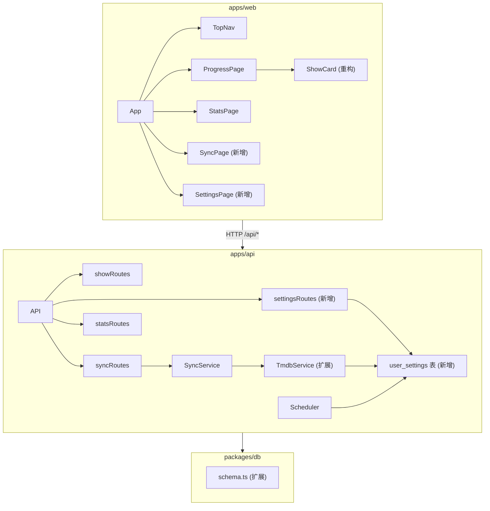

# Design Document: ui-redesign-multilang

## Overview

本次重构对 trakt-dashboard 进行全面的 UI 与后端升级：

1. **布局重构**：将左侧固定侧边栏替换为顶部水平导航栏（TopNav），新增 `/sync` 和 `/settings` 两个路由页面。
2. **ShowCard 重设计**：从紧凑行列表改为海报大图卡片网格，参考 Trakt 官网风格。
3. **多语言标题支持**：`shows` 表新增 `original_name`、`translated_name`、`display_language` 字段；TMDB Service 支持 `language` 参数；ShowCard 按优先级展示翻译标题。
4. **用户设置持久化**：新增 `user_settings` 表和 `/api/settings` 接口，存储 `displayLanguage`、`syncIntervalMinutes`、`httpProxy`。
5. **动态代理与调度**：TMDB Service 和 Scheduler 在运行时从 `user_settings` 读取代理和同步间隔，无需重启即可生效。

---

## Architecture



### 关键变更点

- `Layout.tsx` 中的侧边栏逻辑迁移至新的 `TopNav.tsx` 组件，同步面板迁移至 `SyncPage.tsx`。
- `ProgressPage.tsx` 移除内嵌的左侧 filter rail，改为顶部 filter tabs（因侧边栏已被 TopNav 占用）。
- `ShowCard.tsx` 完全重写为海报卡片风格。
- `packages/db/src/schema.ts` 新增 `userSettings` 表，`shows` 表新增三个多语言字段。
- `apps/api/src/services/tmdb.ts` 的 `getTmdbShow` 签名扩展为 `getTmdbShow(tmdbId, language?)`，代理从 DB 动态读取。
- `apps/api/src/jobs/scheduler.ts` 的 `registerUserSyncJob` 从 `user_settings` 读取间隔。

---

## Components and Interfaces

### 前端组件

#### `TopNav.tsx`（新增）

```tsx
interface TopNavProps {
  username: string | null
  onLogout: () => void
}
```

- 渲染四个导航项：Statistics (`/stats`)、Progress (`/progress`)、Sync (`/sync`)、Settings (`/settings`)
- 使用 `useLocation()` 判断当前路由，高亮激活项（`location.pathname.startsWith(to)`）
- 左侧：Logo `trakt·dash` + `@{username}`
- 右侧：登出按钮
- 高度固定 `56px`，`position: sticky; top: 0; z-index: 40`
- 响应式：`< 768px` 时导航项缩短为图标 + 短标签，不换行

#### `Layout.tsx`（重构）

移除侧边栏，改为：

```tsx
<div style={{ minHeight: '100vh', background: 'var(--color-bg)' }}>
  <TopNav username={auth?.user?.traktUsername ?? null} onLogout={logout} />
  <main style={{ paddingTop: '56px' }}>
    <AnimatePresence mode="wait">
      <motion.div key={location.pathname} ...>
        {children}
      </motion.div>
    </AnimatePresence>
  </main>
</div>
```

#### `SyncPage.tsx`（新增）

从 `useSyncStatus()` 获取数据，`refetchInterval` 在 `running` 时为 `1500ms`（≤ 2000ms）。

状态机渲染逻辑：

| `status`    | 渲染内容                                      |
|-------------|-----------------------------------------------|
| `running`   | 进度条 + `progress/total` + `currentShow`     |
| `idle`      | "立即同步"按钮 + `lastSyncAt`                 |
| `completed` | "立即同步"按钮 + `lastSyncAt` + 可选失败列表  |
| `error`     | 错误信息文本 + "立即同步"按钮                 |

失败列表：当 `failedShows.length > 0` 时渲染，每项展示 `title` 和 `error`。

#### `SettingsPage.tsx`（新增）

```tsx
interface SettingsFormValues {
  displayLanguage: string      // BCP 47，默认 'zh-CN'
  syncIntervalMinutes: number  // 1–10080
  httpProxy: string            // 空字符串或 http(s):// URL
}
```

- `useEffect` 挂载时调用 `GET /api/settings` 填充表单
- 保存时调用 `PUT /api/settings`，成功后展示 toast 提示
- 失败时展示内联错误，表单保持打开

#### `ShowCard.tsx`（重构）

从行列表改为竖版海报卡片：

```
┌─────────────────┐
│                 │
│   海报图片       │  ← w300, aspect-ratio: 2/3
│   (或占位图标)   │
│                 │
├─────────────────┤
│ 主标题           │  ← translatedName ?? title
│ 副标题（可选）   │  ← originalName（仅当 translatedName 非 null）
│ traktId · tmdbId│
│ ████░░░ 60%     │  ← 进度条
│ 12 / 20 eps     │
└─────────────────┘
```

Props 不变（`ShowProgress`），但 `show` 类型扩展后包含 `translatedName`、`originalName`。

图片使用 `tmdbImage(show.posterPath, 'w300')`（≥ w300 规格）。

#### `ProgressPage.tsx`（适配）

移除内嵌左侧 filter rail，改为页面顶部的 filter tabs 行（水平排列），其余逻辑不变。

### 后端路由

#### `settingsRoutes`（新增，`apps/api/src/routes/settings.ts`）

| Method | Path            | 描述                                      |
|--------|-----------------|-------------------------------------------|
| GET    | `/api/settings` | 返回当前用户设置，不存在则返回默认值       |
| PUT    | `/api/settings` | Upsert 用户设置，校验后返回完整设置对象   |

PUT 请求体：

```typescript
interface PutSettingsBody {
  displayLanguage?: string
  syncIntervalMinutes?: number
  httpProxy?: string | null
}
```

校验规则：
- `syncIntervalMinutes`：若提供，必须为 1–10080 的整数，否则返回 `400`
- `httpProxy`：若提供且非空，必须匹配 `^https?://` 格式，否则返回 `400`

---

## Data Models

### `user_settings` 表（新增）

```typescript
// packages/db/src/schema.ts
export const userSettings = pgTable('user_settings', {
  id: serial('id').primaryKey(),
  userId: integer('user_id')
    .notNull()
    .references(() => users.id, { onDelete: 'cascade' })
    .unique(),
  displayLanguage: text('display_language').notNull().default('zh-CN'),
  syncIntervalMinutes: integer('sync_interval_minutes').notNull().default(60),
  httpProxy: text('http_proxy'),
  updatedAt: timestamp('updated_at').defaultNow().notNull(),
})
```

### `shows` 表扩展

```typescript
// 在现有 shows 表定义中新增三列
originalName: text('original_name'),
translatedName: text('translated_name'),
displayLanguage: text('display_language'),
```

### `Show` 类型扩展（`packages/types/src/index.ts`）

```typescript
export interface Show {
  // ... 现有字段 ...
  originalName: string | null    // 新增
  translatedName: string | null  // 新增
  displayLanguage: string | null // 新增
}
```

### `UserSettings` 类型（新增，`packages/types/src/index.ts`）

```typescript
export interface UserSettings {
  userId: number
  displayLanguage: string
  syncIntervalMinutes: number
  httpProxy: string | null
}
```

### `TmdbShow` 类型扩展（`apps/api/src/services/tmdb.ts`）

```typescript
export interface TmdbShow {
  // ... 现有字段 ...
  original_name: string  // 新增
}
```

### TMDB Service 缓存键策略

`getTmdbShow(tmdbId, language?)` 的缓存键：

- 无 `language`：`String(tmdbId)`（向后兼容）
- 有 `language`：`${tmdbId}_${language}`（如 `12345_zh-CN`）

不同语言使用不同缓存键，避免语言混淆。

### 数据库迁移

新增迁移文件 `packages/db/drizzle/0002_multilang_settings.sql`：

```sql
-- user_settings 表
CREATE TABLE IF NOT EXISTS user_settings (
  id SERIAL PRIMARY KEY,
  user_id INTEGER NOT NULL UNIQUE REFERENCES users(id) ON DELETE CASCADE,
  display_language TEXT NOT NULL DEFAULT 'zh-CN',
  sync_interval_minutes INTEGER NOT NULL DEFAULT 60,
  http_proxy TEXT,
  updated_at TIMESTAMP DEFAULT NOW() NOT NULL
);

-- shows 表新增多语言字段
ALTER TABLE shows ADD COLUMN IF NOT EXISTS original_name TEXT;
ALTER TABLE shows ADD COLUMN IF NOT EXISTS translated_name TEXT;
ALTER TABLE shows ADD COLUMN IF NOT EXISTS display_language TEXT;
```

---

## Correctness Properties

*A property is a characteristic or behavior that should hold true across all valid executions of a system — essentially, a formal statement about what the system should do. Properties serve as the bridge between human-readable specifications and machine-verifiable correctness guarantees.*

### Property 1: Settings round-trip

*For any* valid `UserSettings` object (with `syncIntervalMinutes` in [1, 10080] and `httpProxy` either null or a valid HTTP/HTTPS URL), calling `PUT /api/settings` followed by `GET /api/settings` SHALL return an equivalent settings object.

**Validates: Requirements 5.3, 5.6**

### Property 2: syncIntervalMinutes 越界拒绝

*For any* integer value outside the range [1, 10080], a `PUT /api/settings` request with that value as `syncIntervalMinutes` SHALL return HTTP 400.

**Validates: Requirements 5.4**

### Property 3: httpProxy 非法 URL 拒绝

*For any* non-empty string that does not start with `http://` or `https://`, a `PUT /api/settings` request with that value as `httpProxy` SHALL return HTTP 400.

**Validates: Requirements 5.5**

### Property 4: ShowCard 翻译标题优先级

*For any* `ShowProgress` where `show.translatedName` is non-null, the rendered `ShowCard` SHALL display `translatedName` as the primary title and `originalName` as the secondary title.

**Validates: Requirements 8.4**

### Property 5: ShowCard 无翻译标题时回退

*For any* `ShowProgress` where `show.translatedName` is null, the rendered `ShowCard` SHALL display `show.title` as the primary title and SHALL NOT render a secondary title element.

**Validates: Requirements 8.5**

---

## Error Handling

### 前端

| 场景                              | 处理方式                                                    |
|-----------------------------------|-------------------------------------------------------------|
| `GET /api/settings` 失败          | 展示错误提示，表单使用默认值填充                            |
| `PUT /api/settings` 返回 400      | 展示内联错误信息，表单保持打开，不重置用户输入              |
| `PUT /api/settings` 返回 5xx      | 展示通用错误提示                                            |
| ShowCard 海报图片加载失败          | `onError` 隐藏 ``，展示 `<Tv2>` 占位图标              |
| SyncPage 轮询失败                 | 静默失败，保留上次已知状态，不中断轮询                      |

### 后端

| 场景                                    | 处理方式                                      |
|-----------------------------------------|-----------------------------------------------|
| `PUT /api/settings` 校验失败            | 返回 `400 { error: "描述性错误信息" }`        |
| `getTmdbShow` 请求超时                  | 现有 `withTimeout` + `fetchWithRetry` 机制    |
| `getTmdbShow` 代理读取失败（DB 不可用） | 回退到环境变量 `HTTP_PROXY` / `HTTPS_PROXY`   |
| Scheduler 读取 `user_settings` 失败     | 使用默认间隔 60 分钟，记录警告日志            |
| `shows` 表写入 `translated_name` 时 TMDB 翻译请求失败 | 跳过翻译字段写入（保持 null），不中断同步流程 |

---

## Testing Strategy

### 单元测试

**Settings API 校验逻辑**
- `syncIntervalMinutes` 边界值：0、1、10080、10081
- `httpProxy` 合法值：`""`, `null`, `"http://proxy:8080"`, `"https://proxy:8080"`
- `httpProxy` 非法值：`"ftp://proxy"`, `"not-a-url"`, `"proxy:8080"`

**TMDB Service**
- `getTmdbShow(id)` 无 language 参数时，URL 不含 `language` 查询参数
- `getTmdbShow(id, 'zh-CN')` 时，URL 含 `language=zh-CN`
- 不同 language 使用不同缓存键

**ShowCard 渲染**
- `translatedName` 非 null：主标题为 translatedName，副标题为 originalName
- `translatedName` 为 null：主标题为 title，无副标题
- `posterPath` 为 null：渲染占位图标，无 `` 元素

**Scheduler**
- 无 `user_settings` 记录时使用默认 60 分钟
- 有 `user_settings` 记录时使用 `syncIntervalMinutes`

### 属性测试（Property-Based Testing）

使用 **fast-check**（TypeScript 生态，适配现有 Bun + TypeScript 栈）。每个属性测试运行最少 **100 次**迭代。

**Property 1: Settings round-trip**
```
Tag: Feature: ui-redesign-multilang, Property 1: Settings round-trip
```
生成器：随机合法 `UserSettings`（`displayLanguage` 为任意 BCP 47 字符串，`syncIntervalMinutes` 为 [1, 10080] 整数，`httpProxy` 为 null 或合法 URL）。
断言：PUT 后 GET 返回等价对象。

**Property 2: syncIntervalMinutes 越界拒绝**
```
Tag: Feature: ui-redesign-multilang, Property 2: syncIntervalMinutes 越界拒绝
```
生成器：随机整数，过滤掉 [1, 10080] 范围内的值（包括负数、0、10081+）。
断言：PUT 返回 HTTP 400。

**Property 3: httpProxy 非法 URL 拒绝**
```
Tag: Feature: ui-redesign-multilang, Property 3: httpProxy 非法 URL 拒绝
```
生成器：随机非空字符串，过滤掉以 `http://` 或 `https://` 开头的字符串。
断言：PUT 返回 HTTP 400。

**Property 4 & 5: ShowCard 标题优先级**
```
Tag: Feature: ui-redesign-multilang, Property 4: ShowCard 翻译标题优先级
Tag: Feature: ui-redesign-multilang, Property 5: ShowCard 无翻译标题时回退
```
生成器：随机 `ShowProgress` 对象，分别设置 `translatedName` 为非 null 和 null。
断言：渲染输出中主/副标题符合预期规则。

### 集成测试

- `GET /api/settings` 在无记录时返回默认值对象
- `PUT /api/settings` 成功后数据库记录与请求体一致
- `shows` 表迁移后三个新字段存在且可读写
- TMDB Service 使用 `user_settings.httpProxy` 时代理生效（需 mock fetch）

### 端到端测试（手动验证清单）

- [ ] TopNav 四个导航项均可点击跳转，激活项高亮
- [ ] SyncPage 在 running 状态下进度条实时更新（≤ 2s）
- [ ] SettingsPage 保存后刷新页面设置值保持
- [ ] ShowCard 在有翻译标题时展示双标题，无时展示单标题
- [ ] 修改 `httpProxy` 设置后，下次 TMDB 请求使用新代理（无需重启）
